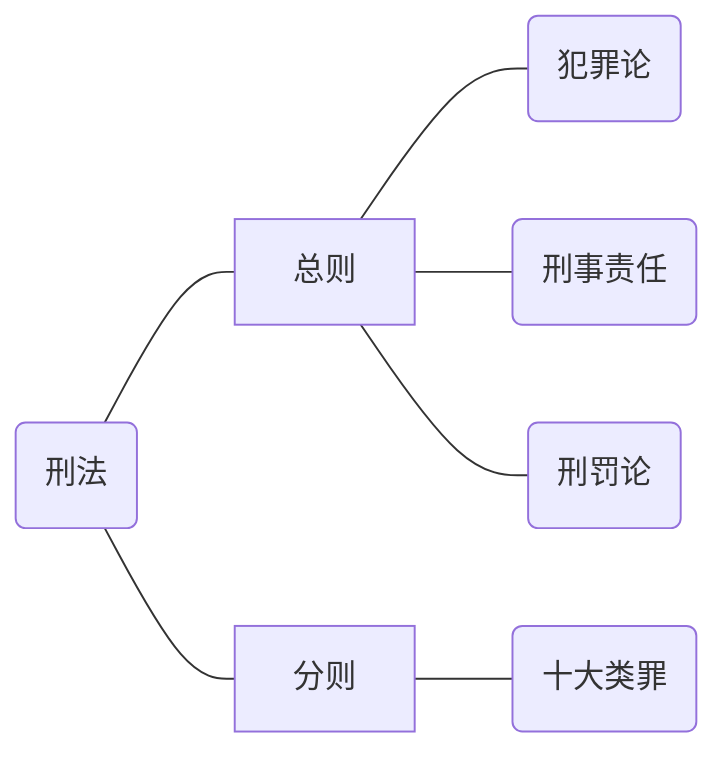

 # 刑法学学习笔记(个人向)
 - 一般来说，拥有总则的一篇法律条文可以被认为是学理上的法典，因为它具有总分结构。故由97年刑法+12篇修正案+单行刑法组成了实际意义上的刑法典。==有总则就是法典，法典都有总则。==  
 - 【注】：以下及之后笔记，有<big><big>🌸</big></big>的全是重点，必考必记必背！！勿谓言之不预。 

 ___
## 1. 刑法学的知识体系  

- 总则简称为**罪、责、刑**。
- 犯罪的主体是人，**刑罚的主体是国家**(公刑而不是私刑)。故，罪与罚背后的关系是人和国家的关系。  
- 刑事责任是犯罪与刑罚之间的桥梁，将国家和人联系在一起。**只有拥有刑事责任能力，犯罪才能够被刑罚**。从理论上讲，==犯罪成立要承担刑事责任==。 但==刑事责任不一定会产生刑罚,绝大多数情况会产生刑罚==。刑事责任的主要形式是刑罚，但除了刑罚之外，还有一些刑事责任的承担方式，例如`禁止进入某个行业`。
- > 十大类罪，由国家到社会再到个人，最后再由个人到社会转回国家：  
  > 1. 危害国家安全罪 （国家） 
  > 1. 危害公共安全罪（社会）  
  > 2. 破坏社会主义市场经济秩序罪(社会)  
  > 3. **侵犯公民人身权利、民主权利**罪（个人）  
  > 1. 侵犯财产罪（国家，个人）  
  > 1. **妨害**社会管理秩序罪（社会）  
  > 2. 贪污贿赂罪（国家工作人员）  
  > 3. 渎职罪（国家机关工作人员）  
- 犯罪论中，犯罪的成立由==犯罪构成==和**阻却**犯罪成立的==正当化事由==组成。其中犯罪成立具有多种说法，包括要考的==四要件==、三阶层、四阶层等。犯罪简单来说**由犯罪成立和==三形态(停止形态、共犯形态、罪数形态)== 组成**。  
- > **是法院在适用刑罚,而不是检察院。** 在中国，是以法院为代表的司法机关独立行使审判权，中国没有英美那种真正的司法独立（`或者说法官独立`）。==法院是量刑机关，法院**可以**是执行机关，但是不是主要执行机关==。主要执行机关是**监狱和看守所**。监狱归狱政机关管理，最高隶属于**司法部**；看守所归公安机关管理，最高隶属于**公安部**。两者是平行机关。  
-  法院执行只管两件事，==**要么要钱**（罚金和没收财产）**要么要命**（由法警执行死刑）== 。  

## 2. 学习方法  
1. 紧扣真题，反复做，每个都思路都要清晰化；  
2. **重者恒重**，关注牢固高频考点； 
3. 体系记忆法，事半功倍（`我要明白我在做什么，我要知道他要做什么`）;
4. 自主总结，易于记忆；
5. **适当参考社会热点**；
6. ==重点关注第十一次刑法修正案==，基本必考，第十二修正案去年年底才刚通过，只有一项与考纲相关，就是`单位受贿`的内容。    

## 3. 绪论   
### 1.  刑法的定义  
 - **规定犯罪及其法律后果的法律规范的综合**。  
    - ==法律后果就是刑事责任和刑罚、非刑罚的处罚==。故刑法也可以归纳为罪与罚的法律规范综合。
### 2. 刑法的形式  
   1. 刑法典：==97刑法和12个修正案==； 
   2. ==单行刑法==：规定**某一类**犯罪及其后果或者刑法**某一项事项**的法律；  
        > 如1998年12月颁布的《全国人民代表大会常务委员会关于惩处   <big>**骗购外汇**</big>、逃汇和非法买卖外汇犯罪的决定》
    3. ==附属刑法==：在经济、行政等**非专门刑事法**中附带规定的一些关于犯罪与刑罚或追究刑事责任的条款。  
        > 如在海关法、环境保护法、票据法中规定的有关追究刑事责任的条款，==它是附属在其他法律里边的，将读者导向刑法的“向量”==，即xxx行为适用刑法，xxx行为要追究刑事责任。   
   - ==刑法典是主体==。  
    【辨析】：  
      1. > 除了97刑法，还有一部(19)79刑法，那部受“左”的思想影响较深，脱离时代需求，在97年做了大量符合时代的修改。这一个大版本的更新，被称为97刑法.这两部刑法本质是一部刑法，只是发生了大版本的更新而已。所以我国各个历史时期自始至终都只有一部刑法。   
      2. > Q：什么是广义刑法，什么是狭义刑法？  
         > A：广义刑法是以上三种（刑法典、单行刑法、附属刑法）；狭义刑法是刑法典。  
      3. > 12个修正案是刑法典的组成成分，但不是刑法的表现形式。刑罚的表现形式是刑法典、单行刑法、附属刑法。**其中单行刑法迄今为止只有一个**，就是《全国人民代表大会常务委员会关于惩处骗购外汇、逃汇和非法买卖外汇犯罪的决定(1998)》。 

   - 我国立法机关是全国人大和全国人大常委会。
   
1. 刑罚的特征：  
     1. 调整范围的广泛性；  
     2. 调整对象的**专门性**； 
         >因为公权力太可怕,如果滥用将导致严重后果。故得把公权力关在笼子里，实行**罪刑法定原理**才能确定犯罪。        
         > 与行政处罚相比，刑法处罚的是<u>财产刑、自由刑、资格刑、生命刑</u>。==刑罚的原则是“**谦抑**”==，要求有**阶梯型量刑**来区分犯罪的好坏程度，避免不必要的杀戮。     
     3. 刑罚制裁的**严厉性**；  
     4. 刑法发动的补充性和保障性；
        > 刑法是为了通过刑罚挽救一个人，使人能够顺利地回归社会。  

### 3. 刑法的任务  
   1. 惩处任务，即**用刑罚同一切犯罪行为作斗争**。  
   2. 保护人民、社会和国家；  
        1. 保护国家安全，保卫人民民主专政的政权和社会主义制度；  
        2. 保护国有财产和劳动群众所有的财产，保护公民私人所有的财产；  
        3. 保护公民的人身权利、民主权利和其他权利；  
        4. 维护社会秩序、经济秩序，保障社会主义建设事业的顺利进行。   

### 4. 刑法的机能<big><big>🌸</big></big> 
   1. 概念：刑法能够产生的**积极作用**或==好的影响==。  
   2. 包含有：  
      1. ==规制==机能（基础的）  
          > 对人的行为进行规制或者约束的机能。将某行为定为犯罪，并加以惩处，要求国民不要行为为之。  
      2. ==保护==机能  
          > 保护国家、社会、公民个人的权益，维护社会正常的生产、生活秩序。  
      3. <big>==**保障**==</big>机能  
          > ==保障公民不受国家刑罚权的不法侵害，以及犯罪人不受刑法规定以外的刑罚处罚==，基于**罪刑法定原则**。    
      - > **保护机能和保障机能是矛盾统一体。**  
      - ==保护机能是保护<big>**社会**</big>绩效的，保障机能是保证<big>**个人**</big>安全的==。  
### 5. 刑法体系<big><big>🌸</big></big>  
   - 已在之前讲过，望复习。  

### 6. 刑罚的条文体系  
   1. 总则的条文主要是对相关刑事法律规则的规定。  
   2. 分则的条文**以犯罪为前提，以刑罚为其主要犯罪后果**，体现具体的“罪与刑”的关系。  

### 7. 刑法的解释<big><big>🌸</big></big>  
   - 分为两类，一种叫**有权解释**，一种叫**无权解释**。  
   - `有权解释`是有司法解释权的国家机关做出的解释，分为：  
        1. ==立法解释==  
            > 指**立法机关**（`只有全国人大常委会`）对刑法的含义做出的解释。  
        2. ==司法解释==  
            > 指**最高司法机关**(`最高人民法院`、`最高人民检察院`)对刑法的含义所作出的解释。   
        - 权威性上看：$立法解释>司法解释$  
          数量上看：$司法解释>立法解释$  
   - `无权解释`，又叫==学理解释==。是指有权对刑法进行立法解释和司法解释**以外的机关、团体和个人**对刑法含义所做的解释。  
   - 除此以外还有不同的分类，例如： 
        1. ==文理解释==  
            > 即**只解释法条的字面意义**，`字面意义=解释意义`。    
        2. **论理解释**  
            根据立法精神与目的对条文进行说明，包括：  
            1. ==扩大解释==  
                解释意义>字面意义； 
                > 例如刑法上的轻微伤是指可以自行恢复的受伤；但轻伤是指不能自行恢复但是经过治疗可以恢复的受伤。这里轻伤做了扩大解释。  
            2. ==缩小解释==  
                解释意义<字面意义；  
            3. ==当然解释==  
                刑法条文虽然没有明确规定，但实际上已经包含在法条的意义中了。  
            4. ==**目的解释**==  
                分三种解释论：  
                1. **主观解释论**：认为刑法解释的目的是**阐明立法者立法时的意图。**  
                2. **客观解释论**：认为刑法解释的目的是**发现社会客观需求**。  
                3. **折中解释论**：认为刑法解释应**兼顾**阐明立法者意图和社会客观需要。  
            5. ==比较解释==  
               将刑法的**相关规定**或者或**外国**立法的判例作为参考资料，以阐明刑法规定的真实含义。  
            6. ==历史解释==  
                按照刑法规定的**国内历史**沿革阐明刑法规定的真实含义。  
   - 用树状图表示上述关系即：   
        ```mermaid
        graph LR
        A[无权解释（学理解释）]---|民间|C{刑法解释}
        B1(立法解释)---|立法机关|B[有权解释]  
        B2(司法解释)---|司法机关|B[有权解释]
        B[有权解释]---|官方|C{刑法解释}  
        C{刑法解释}---D[文理解释]-.-D1(字面意义=解释意义)
        C{刑法解释}---E[论理解释]  
        E[论理解释]---F(扩大解释)-.-F1[字面意义<解释意义]
        E[论理解释]---G(缩小解释)-.-G1[字面意义>解释意义]  
        E[论理解释]---H(当然解释)-.-H1[理所当然应该包括的内容]  
        E[论理解释]---I(目的解释)
        E[论理解释]---J(比较解释)
        E[论理解释]---K(历史解释)
        I(目的解释)-->I1[主观解释论]-.-I11[阐明立法者意图]  
        I(目的解释)-->I2[客观解释论]-.-I22[发现社会客观需求] 
        I(目的解释)-->I3[折中解释论]-.-I33[上述两者的调和和兼顾]
        ```
        【注】左右两侧树杈的分类方式不同，无法进行比较。例如`扩大解释和学理解释不是同一类的，没法比较。`   
### 8. 刑法的==三大==基本原则<big><big>🌸</big></big>  
   1. ==<big>**罪刑法定**</big>== 原则 
       1. **法定化**，即犯罪和刑罚必须事先有法律明文规定。==法无明文规定不为罪，法无明文规定不处罚==。  
       2. **禁止事后法，法不溯及既往**，犯罪行为发生后生效的法律，不能适用于其生效前发生的犯罪行为，==除非有利于被告人==。但***一旦判决结束，不允许根据新法从轻再判***。综上所述，为<mark>**从轻兼从旧**</mark>原则。  
       3. **禁止类推**，`类推指比照最相似的法条对无明文规定的情况推理适用`。
       4. **禁止绝对不确定的刑罚**，既无上限，也无下限的刑罚具有不确定性，应当禁止。  
       5. **明确性**，对于什么行为是犯罪以及犯罪所产生的法律后果，必须具体规定，表述清楚，禁止采用习惯法、不明确的罪状、不确定的刑罚。  
       6. **适当性**，合理确定犯罪的范围和惩罚的程度，**禁止滥刑、酷刑**。  
       - 用图标表示<big><big><mark>**一化二性三禁止**</mark></big></big>为：
        ```mermaid
        graph LR
        A[罪刑法定原理]---B1(法定化)  
        A[罪刑法定原理]---B2(禁止事后法)  
        A[罪刑法定原理]---B3(禁止类推)  
        A[罪刑法定原理]---B4(禁止绝对不确定的刑罚)  
        A[罪刑法定原理]---B5(明确性)  
        A[罪刑法定原理]---B6(适当性)
        ```  
   2. ==刑法**适用平等**原则==  
        对所有的人，不论其社会地位高低、民族、种族、性别、职业、信仰、财产情况如何，在定罪量刑以及行刑的标准上都平等地按照刑法规定处理，不允许有任何歧视或有待，也就是**法律面前人人平等**。  
   3. ==**罪责刑相适应**原则==（`刑罚要有一个坡度，不能不分轻重判刑`）  
        1. 对重罪适用重刑，对轻罪适用轻刑；  
        2. 刑罚的轻重与犯罪行为对社会造成的实际危害程度、犯罪人主观恶性的深浅、再次犯罪危险性、犯罪的事实、犯罪的性质或情节、对于社会的危害程度相适应。  
        3. **对累犯从重处罚**，对中止犯罪处罚明显轻缓于未遂犯、预备犯，对过失犯罪处罚明显轻缓于故意犯。   
   - > **刑法基本原则确立了罪、责、刑各自相对独立又互相影响的关系，是构建中国特色刑法理论体系的制度基础**。  

### 9. 刑法的效力范围<big><big>🌸</big></big>  
   - 效力即约束力。刑法的效力范围包括空间效力和时间效力。  
   1. 空间效力四原则  
        1. ==属地原则==（No.1）
            > 只管辖发生在本国领域内的犯罪（**在我这发生就管**）  
            - 属地只要沾边就可以管。不论是`行为地`、`经过地`、`结果地`哪一个，只要与中国有关就可以管。 
        2. ==属人原则==  
            > 只管辖本国公民实施的犯罪。（**是我的人就管**）  
        3. ==保护原则==  
            > 只管辖侵害本国利益的犯罪。（**没惹我就不管**）  
        4. ==普遍管辖原则==  
            > 对侵犯人类共同利益的国际犯罪都要行使管辖权。要求伤害普遍利益且==有国际条约作为基础的==（**都TM要管**）  
        - 我国刑法采取**以属地原则为基础**，**其他原则为补充**的==综合性原则==。
        - 效力范围包含中国领域内和中国领域外，**是属地管辖的引申**。  
   2. 在中国领域内的效力：    
        - 具体为：    
            1. 凡在**中国领域内**犯罪的，除法律有特别规定的以外，**都适用**中国刑法；  
            2. **享有外交特权和豁免权**的外国人的刑事责任，通过**外交途径解决**；
            3. **港澳**地区犯罪由当地的司法机构**适用当地**刑法；        
                > 根据一国两制，港澳有自己的**法域**，除非是涉及国家安全的案件需要提交，但这种情况是极少见的。  
            4. ==凡在中国<big>**船舶**</big>或者<big>**航空器**</big>内犯罪的，也适用中国领域内犯罪==（`移动国土`）；  
            5. ==犯罪行为或者结果有一项发生在中国领域内的，就认为是在中国领域内犯罪,就**可以**管辖。==（`沾边原则`）  
   3. 在中国领域外的效力：  
        1. ==【中国公民】在中国领域外犯罪，适用中国刑法==（`属人管辖`）；但根据犯罪按照我国刑法<big>**最高刑**</big>在3年以下有期徒刑的（==轻罪以下==），==**可以**不予追究==。  
        2. ==中国国家工作人员和军人犯罪一律适用中国刑法==；  
        - **【外国人】在中国领域外对中国公民或者国家犯罪**，按照我国刑法规定的<big>**最低刑**</big>为3年以上有期徒刑的（==重罪==），==**可以**适用我国刑法==。但按照犯罪地法律不受处罚的除外；（`保护管辖`）  
        1.  对于中国**缔结或参加的国际条约所规定的罪行**（`要求侵犯全人类的共同利益，例如恐怖分子`），中国在承担条约义务的范围内行使刑事管辖权。即使罪行不是发生在中国领域，未侵犯中国国家或公民，犯罪人不具有中国国籍，我国的司法机关**也有权管辖**该案件（`普遍管辖权`）;   
        - >【注】：一般在外国犯罪受过刑罚的犯罪分子回国后，我国的司法机关根据中国的刑法**仍可以再处罚**犯罪分子，选择权在我国司法机关。  
      - > 一般在答题中，考得比较多的是【属人】、【属地】和【沾边】三个原则。只要遇到这种题，记住**中国对犯罪一般都能管辖，但不一定管，选择权在我**。  
   4. 刑法的时间效力  
        - 即`生效`、`失效`、`溯及力`三个知识点。  
        1. **生效**
            一般分为两种：  
            1. 公布之后一段时间生效；（`重要的法律都是这样`） 
            2. 自公布之日起生效；（==<small>单行刑法和刑法修正案一般采取这种方式。</small>==）
       
       2. **失效**  
           1. 由**国家立法机关明确宣布**自何日起失效；  
           2. **自然失效**，即新法取代了有关旧法，或由于原来特殊的立法条件已经消失，旧法自行废止。  
        3. **溯及力**<big><big>🌸</big></big>  
            - 简而言之一个原则：==从旧兼从轻==。  
            - ==**法不溯及既往，除非有利于被告人**==。溯及既往的时候应该注意：==从旧看的是<big>**行为时**</big>的法律。==  
            - `处刑从轻`要求对照新旧法条，做到：  
                1. 法定最高刑从轻；
                2. 若法定最高刑相同，则法定最低刑从轻；  
            - 【注】：==处刑较轻指选择<big>**法定刑较轻**</big>的判决，而不是判处宣告刑较轻==。例如`判处三年以上七年以下有期徒刑是法定刑,最后判了六年有期徒刑是宣告刑`。  
            - > Q：如何确定犯罪的法定最低刑和法定最高刑？ 
              > A：
              > 1. 若只有一个法定刑幅度，则法定最低刑指幅度的下限，法定最高刑指幅度的上限。  
              > 2. 若有两个以上的法定刑幅度，法定最高刑或者说法定最低刑是指具体犯罪行为应当适用的法定刑幅度（==看最终怎么判的区间==）的最高刑或最低刑。   

## 4. 犯罪概念  
### 1. 中国刑法对犯罪的定义     
   - 即标准的十大类罪，但尤其得注意==上述十类行为，<big>**情节显著轻微危害不大**</big>(必背)的，不认为是犯罪==。  
   - > 情节显著轻微危害不大，可以是质的问题，也可以是量的问题。  
   - 犯罪的概念可以分为**形式概念**（`刑法明文规定`）和**实质概念**（`严重危害社会`）。==犯罪是形式和实质概念的结合，但形式更重要==。 
   - **法律追求的是形式正义，是程序正义，而不是实体正义。**  
 
### 2. 但书<big><big>🌸</big></big>  
  - 就是“==情节显著轻微危害不大的，不认为是犯罪==”这句话。它表明了认定犯罪不仅需要定性，还需要定量和定危害程度。**它赋予司法机关酌情排除犯罪的权力。**
  - “但书”缩小了犯罪或刑事处罚的范围，避免给一些轻微危害行为和违法行为打上犯罪标签，可以提高改造效率，合理配置资源，集中惩处严重的违法行为（犯罪），**是区分“违法行为”和“犯罪行为”的宏观标准**。  
  - 不论是从节约开销，体恤民力的角度，还是限制公权力，倡导向善的角度，还是防止刑罚过滥，法律被虚置的角度考虑，**刑法不能过严，惩罚不能过厉，罪名不宜过多**。  
  - ==当前，我国司法机关根据“但书”规定涉案企业刑事合规制度。==  
  - 根据“但书”精神，对于经济类犯罪的判定，我们一般都是根据实际的数量定罪量刑的。**它的量要达到。**   

### 3. 犯罪基本特征
  - 即犯罪三性。
  1. 犯罪是严重危害社会的行为，具有严重的==社会危害性==；（`实质性`）  
  2. 犯罪时触犯刑法的行为，具有==刑事违法性==。（`形式性`）  
  3. 犯罪是应受刑罚惩罚的行为，具有==应受刑法惩罚性==。（+`但书`）  

## 5. 犯罪构成<big><big>🌸</big></big>  
  - > 是刑法的**核心**。  
  - 犯罪构成指刑法规定的成立犯罪必须具备的**主观要件**和**客观要件**的总和。  
        1. 犯罪构成是犯罪成立的必要条件；  
        2. 犯罪构成的诸要件是由刑法规定的（`罪刑法定`）；  
        3. 具备犯罪构成要件是适用刑罚法律后果的**前提**。==但完全符合犯罪构成，最后也不一定会被判犯罪==。   
  - 
     ```mermaid
    graph LR  
    A[行为]---C1(1. 符合犯罪构成)-->B(犯罪)  
    A[行为]---C2(2. 没有正当化事由)-->B(犯罪)
     ```  
### 5.1 违法行为的层次  
   1. 但书，不构成犯罪；  
   2. 构成犯罪，但是情节没到刑罚标准，不予处罚；  
   3. 构成犯罪，承担刑罚；  
      > `例如：张三喜欢小偷小摸，但一直都停留在顺苹果的水平，情节显著轻微危害不大，不构成犯罪。之后他两年两次偷窃，金额合起来不超过3000元，虽然构成犯罪但是没到刑法标准，不予刑罚处罚; 但他最近偷了别人6000元的手机，超过刑罚标准，构成盗窃罪。`   
   - 法硕考试期间采取的犯罪构成方式是**四要件学说**，即：  
       > 1. 客体(==法益==)；  
       > 2. 客观方面；  
       > 3. 主体(==人、单位==)；  
       > 4. 主观方面；  
   - **刑法是先客观再主观**。只有达到了客观的犯罪构成，才会开始考虑行为人主体的条件和主观方面的成分。其背后体现的原则是<mark>**主客观相统一**</mark>,其中考察的是事件与行为的**因果关系**，再考虑**主体**是否成立。  
   - ==犯罪概念是犯罪构成的基础，犯罪构成是犯罪概念的具体化。==   
### 5.2 犯罪构成的意义  
   1. 是法律规定的确立犯罪的要件，是：  
        > 1. 成立==罪与非罪==的标准； 
        > 2. 成立==一罪还是数罪==的标准； 
        > 3. 区别==此罪与彼罪==的标准；  
        > 4. 区别==轻罪与重罪==的标准；  
   2. **强调依据犯罪构成定罪量刑**；  
   3. 犯罪构成是刑法理论的核心和刑法理论体系的基础。  
### 5.3 犯罪构成分类<big><big>🌸</big></big> 
  
1. `基本`构成：==既遂犯==的构成；  
2. `修正`构成：**预备犯**、**未遂犯**、**中止犯**等==停止形态==的犯罪构成和==共同犯罪==的犯罪构成；  
3. `标准`构成：==刑法条文==对具有通常社会危害程度的行为==所规定的==犯罪构成；  
4. `派生`构成：(结果)==加重==的犯罪构成和==减轻==的犯罪构成；  

### 5.4 犯罪构成四要件  
详细见于《刑法学术术语解读》一文中，这里就不再赘述。  
- **一般客体**：法益和受法律保护的社会关系,即所有的东西合在一起；  
    - ==一般客体是指社会主义社会关系的整体。==
#### 5.4.1 **十大同类客体**：对应十大类罪，分别是：  
    1. 国家安全；  
    2. 公共安全； 
    3. 社会主义市场经济秩序；  
    4. 公民的人身和民主权利； 
    5. 公民财产权； 
    6. 社会管理秩序； 
    7. 国防利益； 
    8. 职务行为的廉洁性；  
    9. 国家机关的正常管理活动； 
    10. 军事利益；  
- ==我国刑法的分则就是依照十大同类客体构建的==。   
- **直接（具体）客体**：每个具体犯罪侵犯的客体；  
- **复杂客体**：一次犯罪行为同时侵犯了多个客体，这多个客体组成复杂客体。  
- > 犯罪对象指人或物，而不是抽象的社会关系或法益。它和客体是两回事。 
- 根据客观方面，犯罪可以分成`行为犯`、`危险犯`、`结果犯（实害犯）`。其中实害犯要求行为、结果和他们之间的因果关系。==对于不要求有结果的犯罪，不需要有因果关系存在。==
- 作为&不作为&纯正不作为  
  1. 作为犯：字如其名；  
  2. 不作为犯：==有义务，能履行而不履行，造成严重后果==的犯罪；  
  3. <big>**纯正的不作为犯**</big>：==只能由不作为形式实现的犯罪==，如：`拒不执行判决、裁定罪`、`不解救被拐卖、绑架妇女、儿童罪`、`玩忽职守罪`。**不作为犯罪的主观方面可以是故意也可以是过失。**  
#### 5.4.2 不作为的义务  
 - 来自于：  
    1. 职务要求的义务(`如警察、军人的职责`)；  
    2. 法定的义务；  
    3. 法律行为引起的义务；  
    4. **先行为造成的义务**（`故不要多此一举或口无遮拦，为人需得慎独`） 
- 危害结果在很多犯罪里都很重要，只要有严重后果，我们就可以定某些行为犯罪。**危害结果对于结果犯、危险犯以及结果加重犯都有意义。**  
- ==因果关系是客观的，是一种**引起和被引起**== 的联系。因果关系不是蝴蝶效应，而是<big>**客观**</big>的、<big>**必然**</big>的、相对的、复杂的(`一因多果`、`多因一果`)联系。  
#### 5.4.3 犯罪主体<big><big>🌸</big></big>  
   > 行为人年龄 
   > 1. 年龄$\geq$16岁，完全刑事责任能力人；
   > 2. ==14$\leq$年龄$\leq$16岁==，限制刑事责任能力人，**只对八大罪负责**； 
   > 3. ==年龄<14岁==，无刑事责任能力人
   > 4. **特殊情况**：  
   >       12$\leq$年龄$\leq$14岁，满足：  
   >            1. 犯故意杀人、故意伤害罪；  
   >            2. ==致人死亡或者以特别残忍手段致人重伤造成严重残疾==；  
   >            3. 情节恶劣；  
   >       **经最高人民检察院核准追诉的，==应当==负刑事责任。**  
   - ==未满12岁的人绝对不负刑事责任==。  
#### 5.4.4 **八大罪（要背下来）**<big><big>🌸</big></big>  
    > 即：  
    > 1. 杀人；  
    > 2. 防火；
    > 3. 抢劫；
    > 4. 强奸；
    > 5. 投毒（投放危险物质）；
    > 6. 贩毒；
    > 7. 爆炸；
    > 8. 故意伤害致人受伤、死亡  

#### 5.4.5 对未成年人的宽大处理     
- 出自刑法和刑法第十一修正案：  
> 1. ==已满14岁不满16岁==的人**偶尔**与幼女发生性关系，情节轻微，未造成严重后果的，不认为是犯罪；（`强奸罪的但书，对青梅竹马现象的修正`）
> 2. ==已满14岁不满16岁==的人使用**轻微暴力或者威胁**，强行索要其未成年人随身携带的生活、学习用品或者钱财，**数额不大**，且未造成被害人轻微伤以上或者不敢正常到校学习、生活等危害后果的，不认为是犯罪；（`轻微校园暴力的但书`）  
> 3. ==已满16周岁不满18周岁==的人实施盗窃行为**未超过三次**，盗窃数额虽**已达到“数额较大”** 标准，但案发后==能如实供述==全部盗窃事实并积极退赃，并具有下列情形之一的，**可以**认定为”情节轻微危害不大“，不认为是犯罪：  
>       1. 盲人或者又聋又哑的人；  
>       2. 在共同盗窃中起**次要作用**或者辅助作用，或者**被胁迫**。  
> 4. ==已满16周岁不满18周岁==的人盗窃**自己家或者近亲**的财物，或者**盗窃其他亲属财物但其他亲属要求不予追究**的，**可**不认为是犯罪。  
> 5. ==对未成年人适用刑罚，**应当**充分考虑是否有利于未成年人罪犯的教育和矫正==。对符合管制、缓刑，处罚金或者免予刑事处罚的未成罪犯，**应当**依法适用制、缓刑，处罚金或者免予刑事处罚。  
> 6. ==未成年人犯罪只有罪行**极其严重**，才可以适用无期徒刑==。原则上，已满十四周岁不满十六周岁的罪犯一般不判无期；  
> 7. 除刑法规定"应当"附加剥夺政治权利的法条外，==对未成年罪犯一般不判处附加剥夺政治权利==。如果对未成年人罪犯判处附加剥夺政治权利的，**应当依法从轻判决**；  
> 8. 对未成年罪犯实施刑法规定的”可以并处“没收财产或者罚金的犯罪，==一般不判处财产刑==，对未成年罪犯判处罚金刑时，**应当从轻或者减轻判处**。
 
#### 5.4.6 影响刑事责任能力的因素  
- 等于==年龄+精神状态==；  
- 具有以下几种情况：  
    1. 精神病人在不能辨认或者控制自己行为的时候（**发病时**）造成危害后果的，**经法定程序鉴定(司法鉴定)确认的**，不负刑事责任；(`全疯`)  
    2. 间歇性精神病人在精神状态正常的时候犯罪，**应当**负刑事责任；（`不疯`）  
    3. 尚未完全丧失辨认能力或者控制自己行为能力的精神病人犯罪的，**应当**负刑事责任，但是**可以从轻或者减轻处罚**；（`半疯`）  
    4. ==又聋又哑的人或者盲人犯罪，**可以**从轻、减轻或者免除处罚==；  
    5. ==醉酒的人犯罪，**应当**负刑事责任==。  
- 特殊主体：指只有特别的对象才能犯的罪，例如`贪污受贿罪`、`渎职罪`等。  
- 对于单位犯罪，有以下说明：  
    1. ==为犯罪设立的“单位”，以及盗用单位名义，不以单位论==；  
    2. **单位犯罪以法律明确规定为限**；  
    3. 采取==两罚制==：  
        1. 对单位**处罚金**；  
        2. 对直接负责的主管人员或者其他直接责任人**判处刑罚**；
- 依法成立的公司也是公司，也可以成为单位犯罪的主体。
#### 5.4.7 犯罪的主观方面  
- 等于==认识因素+意志因素==，包含有==6个==，分别是**故意两个、过失两个、目的、动机**；  
- 罪过：对危害后果所持==故意==或者==放任==的心理态度；  
- 无罪过事件：  
    1. 意外事件，无法预料；  
    2. 不可抗力，主要指天灾人祸；  
    3. **期待可能性**：在行为人实施犯罪的具体场合，**期待其实施适法行为**而不实施犯罪行为的可能性。  
- 有罪过事件：  
    1. 直接故意（==明知故犯==）；  
    2. 间接故意（==明知故纵==）；  
    3. ==疏忽大意==的过失；  
    4. ==过于自信==的过失；  
- 犯罪目的和犯罪动机要求犯罪行为人，**有没有认识到相应的行为与后果**，有没有认识到犯罪的基本事实；  
- |罪过形式|认识因素|意志因素|是否惩罚| 
  |:---:|:---:|:---:|:---:|  
  |直接故意|明知|希望|必须惩罚|
  |间接故意|明知|放任|必须惩罚|
  |过于自信的过失|已遇见|轻信避免|未造成结果不惩罚，造成结果从轻或减轻处罚|
  |疏忽大意的过失|应遇见未预见|疏忽大意|未造成结果不惩罚，造成结果从轻或减轻处罚|
  |无罪过事件|不应遇见也不能预见|无|不处罚|  
- 犯罪目的和动机包括：  
    `以营利为目的`、`以牟利或传播为目的`、`以出卖为目的`等。**目的常用于犯罪的定罪当中**  
- 认识错误：  
    1. **法律上认识错误**  
        > 即对法条不理解或者不充分理解，造成对自己行为的犯罪误区。  
        
        包括假想非罪、假想犯罪、罪名与罪行轻重发生误解，该无影响。
    2. ==事实上认识错误==<big><big>🌸</big></big>   
        它包含五大类认知错误，即：       
        > 1. **打击错误(行为偏差)**；
        > `水平不行拉跨了`   
        > 2. **对象错误**；  
        >  `找错犯罪对象,认错人了`
        > 3. **客体错误**；  
        > `犯罪侵犯的法益变了`  
        >       > <small>例如：盗窃背包的时候偷到92g手枪,盗窃罪变盗窃枪支罪。</small>
        > 4. **因果关系错误**；  
        > `事情的发展与想象的不一样，因果关系不同`
        >       > 例如：张三开枪打中李四脑袋，张三以为李四死了就把他丢井里，结果尸检报告显示李四死于溺亡，不是枪杀。  
        > - 事实上，==即使犯罪存在认知错误，只要行为本身是故意的且最终达成了目的，就可以认为是犯罪既遂。== 
        > 5. **手段错误**；  
        > `手段错误压根造成不了犯罪，是手段不能犯未遂`  
        > - ==手段错误恶意过强定犯罪未遂。==  
        > 例如：投毒杀人，误把白糖当砒霜。


### 5.5 犯罪构成的另外两种学说  
- 类似于相框，四要素的四条边共同框出了犯罪的性质、成分。虽然它的上手简明扼要，易于推广。但其在论证过程中缺乏对犯罪特殊场景的解读，存在很大缺陷。例如：`共同犯罪`和`正当化事由`，以及`期待可能性`，以上内容需通过补丁才能补全。  
- 所有大陆法系使用最广泛的是“`三阶层`”为代表的**阶层论**。他能更合理和包容地解释上述司法问题。但它在对“`罪刑法定`”原则为代表的**对公权力执法的限制**上存在天然的缺陷,此方面不如四要件。故为融会贯通，应同时掌握两种论述的思路以观后效。
- > Q：什么是“阶层论”？ 
  > A：通过一级一级的层次，将行为的危害程度分层，只有达成这一层的所有条件才有办法向下一阶层跨域，直到最终严重到可以被认定为“犯罪”。
1. **三阶层**  
    - 如图所示，推到犯罪的过程等于==一步一步走台阶下深渊==：  
        ```mermaid
        graph LR  
            subgraph 一阶层  
                o1((构成要件符合性))-.-a1[行为主体]  
                o1((构成要件符合性))-.-b1[行为]  
                o1((构成要件符合性))-.-c1[行为结果]
                a1[行为主体]--->|动机|b1[行为]--->|因果关系|c1[行为结果]  
            end  
            subgraph 二阶层  
                o2((违法阻却事由))-.-a2[正当防卫]  
                o2((违法阻却事由))-.-b2[紧急避险]
                o2((违法阻却事由))-.-c2[被害人承诺] 
            end  
            subgraph 三阶层
                o3((有责性))-.-a3[主观]  
                o3((有责性))-.-b3[责任阻却事由]
                a3[主观]-.-a31[故意]  
                a3[主观]-.-a32[过失]  
                b3[责任阻却事由]-.-b31[责任年龄]  
                b3[责任阻却事由]-.-b32[责任能力]  
                b3[责任阻却事由]-.-b33[违法认识可能性]  
                b3[责任阻却事由]-.-b34[期待可能性]
            end  
            o1((构成要件符合性))==>|客观条件满足犯罪要求，看能不能阻却|o2((违法阻却事由))===>|不能阻却，看主体条件有没有刑事责任|o3((有责性))    
        ```    
    - 关于犯罪的本质，具有两种学说：==法益侵害说==、==规范违反说==。  
        1. **法益侵害说**认为犯罪的本质是行为人对法律保护的法益造成危害，认为刑法目的在于保护法益；(`实质，从法律一开始设置的目的区分权责，划定边界区间，凝聚社会共识的角度思考`)  
            - **法益侵犯说**认为，==犯罪构成要件不仅要包含无价值的行为，还需要有无价值的结果==。无价值的结果指行为对法益造成刑法所不容许的危害结果（包括**实害结果**和**危险结果**，危险结果是实害结果的未现实化）
        2. **规范违反说**认为，犯罪是违反刑法规范的表现，刑法的目的在于规范人的行为。（`形式，从统治和管理的角度思考`）
            - **规范违反说**认为，只要行为无价值，即为违法，行为所导致的结果只影响犯罪形态。  
        - > 期待可能性中国司法体系没有明确采纳，可以认为没有这项。   
2. `两阶层`\*   
    - 与“三阶层"相比没有本质的区别，只是将第二步的判断和第一层的判断融合在一起而已，形成新的第一层“**不法**”或者说：  
        $$构成要件符合性(积极的不法)+违法阻却事由(消极的不法)=不法$$  
    - 原先的第三层单成一阶层为”**有责**“。
    -   
        ```mermaid  
        graph LR 
            subgraph 二阶层:主观违法层面  
            b1{有责}-.-b11[主观要件]  
            b1{有责}-.-b12[（主观）违法阻却事由]  
            b11[主观要件]-.-b111[犯罪故意]  
            b11[主观要件]-.-b112[犯罪过失]  
            b11[主观要件]-.-b113[无罪过事件]  
            b11[主观要件]-.-b114[事实认识错误]  
            b12[（主观）违法阻却事由]-.-b121[责任年龄]  
            b12[（主观）违法阻却事由]-.-b122[责任能力]  
            b12[（主观）违法阻却事由]-.-b123[违法性认知可能性]  
            b12[（主观）违法阻却事由]-.-b124[期待可能性]   
            end   
            subgraph 一阶层:客观违法层面  
            a1{不法}-.-a11[客观要件]  
            a1{不法}-.-a12[（客观）违法阻却事由]  
            a11[客观要件]-.-a111[行为主体]  
            a11[客观要件]-.-a112[危害行为]  
            a11[客观要件]-.-a113[行为对象]  
            a11[客观要件]-.-a114[危害结果]  
            a11[客观要件]-.-a115[因果关系]  
            a12[（客观）违法阻却事由]-.-a121[正当防卫]  
            a12[（客观）违法阻却事由]-.-a122[紧急避险]  
            a12[（客观）违法阻却事由]-.-a123[被害人承诺等]
            end
            a1{不法}==>|进一级|b1{有责}
        ```  

## 6. 正当化事由  
- 行为具有完备的犯罪构成，但具有正当化事由，犯罪成立就可以被**阻却**。  
-   犯罪成立，需要满足:
    - >   1. ==符合犯罪构成== + ==没有正当化事由==    **质**
    - >   2. ==没有但书==（情节显著轻微危害不大，不认为是犯罪） **量** 
    - 如果上述这两条都有的话，那犯罪成立。  
- **正当化事由包含非常多种类型**，其中最为有名的是`正当防卫`、`紧急避险`，除此以外还有：`依法(法律法规)行为`、`依(行政)命令行为`、`业务行为`、`权利人承诺`、`自救行为`等。  
    > 【注】权利人承诺必须以权利本身的内涵为基础的，超越了这个范畴将不再认为是正当化事由。而在司法实践上，==一般认为人身权利和人格尊严是不容放弃的==，或者说它们虽然隶属于人，但实质上不为人所处分，属于某种更高位的形而上的存在。  
### 6.1 正当防卫<big><big>🌸</big></big> 
- 生效条件(<span style="background-color: #66ff66">背下来</span>)：  
    1. 【起因条件】起因是**有社会危害性和侵害紧迫性的行为**发生；  
    2. 【时间条件】==不法侵害正在进行==；  
    3. 【对象条件】==只针对侵害者本人==；  
    4. 【限度条件】==不能超过明显限度==；  
    5. 【主观条件】防卫者**主观上出于防卫**的目的；  
        ___   
    > 这五大条件要**全部满足才要认定为正当防卫**。  
- 关于正当防卫有一些相近的概念：  
    1. ==特别防卫==  
        > 又叫`无限防卫`，即对【正在发生】的**行凶、杀人、抢劫、强奸、绑架以及其他严重危及人身安全的<big>==暴力犯罪==</big>**，==采取防卫行为，造成不法侵害人伤亡，不负刑事责任==，一般不负民事责任。  
    2. 假想防卫  
        > 压根不存在需要防卫的情况而进行了防卫。  
    3. 防卫挑拨  
        > 为了达成自己能够正当防卫的目的而进行的对他人的挑拨。  
    4. 事前防卫  
        > 暴力犯罪还没有开始，未雨绸缪先**下手为强**进行防卫。  
    5. 事后防卫  
        > 暴力犯罪已经结束，**怀恨在心**进行报复的防卫。   
        - > 现在的司法精神要求**不能过于机械地适用法条**，只要在暴力犯罪结束后不久(`动作是连贯的，不是过了几个小时以上或者当事人已经离开现场的情况`)进行防卫就可以被认定为正当防卫。  
    6. ==防卫过当==  
        > 明显超过限度的防卫行为。  
        > (`在考试中具体体现为犯人只是想侵害你的财产权，你却侵害了他的人身权、生命权`)。  
        
        刑法要求，==防卫过当**应当**减轻或免除处罚。== 
    
### 6.2 紧急避险<big><big>🌸</big></big>  
- 发生条件  
    > 1. 必须有需要避免的危险存在；
    > 2. **危险正在发生**；
    > 3. ==万分无奈，迫不得已==；  
    > 4. ==为了保全更大的法益==；  
    > 5. 不能超过必要限度；  
    - 紧急避险的要求比正当防卫更严格，必须以上五点同时满足，紧急避险才能成立。  
    - > 用生命权换生命权的行为原则上不属于紧急避险。  
- 与正当防卫相比，紧急避险的区别在于：  
    1. ==针对第三人==；  
    2. 利益权衡；  
    3. 迫不得已； 
    4. ==可以适用于自然灾害，但**职责者在上班期间不可以紧急避险**==；  
- 紧急避险也存在过当的情况，按照刑法规定，==避险过当**应当**减轻或免除处罚==。  

## 7. 故意犯罪的停止形态  
- 【注意】==只有直接故意犯罪才有停止形态==。  
- 指故意犯罪过程中，因为某种原因而停止所呈现的状态，即**犯罪进展的结局状态**。停止形态可以分为**完成形态**和**未完成形态**。  
- > 四种形态：犯罪**既遂**（`完成形态`）、犯罪**未遂**、犯罪**预备**、犯罪**中止**（`未完成形态`）。  
- |`停止原因\犯罪阶段`|犯罪准备(预备)阶段|犯罪实施阶段|
    |---|---|---|
    |客观上做不了|犯罪预备|犯罪未遂|
    |主观上不想做了|犯罪中止|犯罪中止(<small>不做细区分了</small>)|  
-   
  ```mermaid
  graph LR
  A[犯罪开始]-->|预备阶段|A1{是否停止}
  A1{是否停止}-->|是|O[犯罪预备]  
  A1{是否停止}-->|否|B[犯罪着手]
  B[犯罪着手]-->O1{是否成功}-->|是|C1[犯罪既遂]  
  O1{是否成功}-->|否|O2{什么原因}-->|主观原因|C2[犯罪中止]  
  O2{什么原因}-->|客观原因|C3[犯罪未遂]  
  C2[犯罪中止]-.-W1[未完成状态]  
  C1[犯罪既遂]-.-W2((完成状态))  
  C3[犯罪未遂]-.-W1((未完成状态)) 
  O[犯罪预备]-.-W1[未完成状态]
  W2((完成状态))===V[犯罪的停止状态]  
  W1((未完成状态))===V[犯罪的停止状态]
  ```  
  
- 在刑法中有三种既遂标准，即：  
    > 1. **结果犯**（**实害犯**）：损害结果发生为既遂;
    > 2. **危险犯**：现实危险存在即既遂；
    > 3. **行为犯**：实施行为即既遂；  

  ||按危害结果进行划分|按犯罪形态进行划分|
  |---|---|---|
  |行为|抽象危险犯|行为犯|
  |危险|具体危险犯|危险犯|
  |侵害|实害犯|结果犯|  
- 
 
   

             
           


             
 

     
        


  
    
   

  