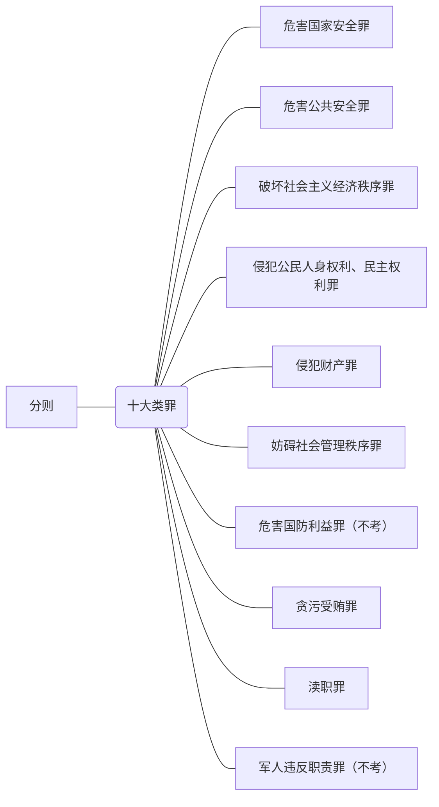

# 刑法学学习笔记(个人向)   Part.2    
 - 在刑法中，`xx以上`或者`xx以下`一般包含`xx`；`未满xx`一般不含`xx`；`已满xx`一般包含`xx`。  
 ___  
## 1. 刑事责任  
 - 犯罪产生刑事责任，刑事责任落实为刑罚。  
 - 在中国法律界，有三种责任，即：  
    1. 民事责任；  
    2. 行政责任；   
    3. 刑事责任；  
    > 其中刑事责任会有案底。  
- >指行为人因其犯罪行为所应承担的、代表国家的**司法机关**(`法院、检察院`)根据刑事法律对该行为做的否认评价和对行为人进行谴责的**可能性**（`可能有人有刑事责任但没有接收刑罚`）;  
- ==法院天然是司法机关，司法机关天然是法院==，检察院在很多国家是行政机关或者隶属于法院。  
    ```mermaid
    graph LR
    A[司法机关]---B1[审判机关]-.-C1[法院]  
    A[司法机关]---B2[检察机关]-.-C2[检察院]
    ```
- 特征  
    1. 刑事责任包含对犯罪行为的**非难性**和对犯罪分子的**谴责性**；  
    2. 刑事责任具备社会性与法律性；  
    3. 刑事责任具备**必然性**和**平等性**；  
    4. 刑事责任具有严厉性和专属性；  
- 刑事责任只能由法律来规定，绝大部分出自刑法典，故==只有刑法才能规定刑事责任==。  
- 我国的学说是**罪、责、刑平行说**，犯罪、刑事责任和刑罚各自独立而又互相联系，其中。责是刑的必要不充分条件，责是罪的必要不充分条件。  
- 刑事责任是介于犯罪与刑罚之间的**纽带**，具体如下：  
    1. ==刑事责任的存在是适用刑罚的直接前提==，无刑事责任不能适用刑罚；  
    2. 刑事责任的大小直接决定刑罚的重轻；  
    3. 刑罚责任主要通过刑罚来实现；  
- 刑事责任有四种解决方式：  
    1. 定罪判刑（`最主要方式，通过适用刑罚来承担刑事责任`）；  
    2. 定罪免刑（不是但书，==但书连罪都不是，根本就不定罪==）；  
    3. **消灭处理**（==阻却事由==）；  
    4. 转移处理（`遇到豁免权，外交途径途径解决`）；  
        > 有且只有特殊的外交人员和驻外大使有外交豁免权。  

## 2. 刑罚概述<big><big>🌸</big></big>  
- 刑罚就是刑事责任的落实（实现）。  
- > 【注意】刑拘是刑事处罚,行拘是行政处罚；罚款是行政处罚，罚金是刑事处罚。  
- 刑罚的概念： 
    > 1. 刑法中明文规定的；
    > 2. 由**国家审判机关**依法对犯罪分子所适用的；
    > 3. **限制或剥夺某项权益**；
    > 4. ==最严厉的制裁方法==；
- 刑罚只能适用于犯罪分子，且其处罚最严厉，**由国家强制力保障**。  
- 刑罚的目的：  
    1. （因果）报应论;  
    2. **特殊预防**  
        > 对犯罪分子本人的预防，预防再犯；   
    4. **一般预防**  
        > 对围观群众的警示威慑，达到预防效果；   
### 2.1. 刑罚的种类  
- 按照剥夺或限制的法益对象分类； 
   1. 生命刑  
   2. **自由刑**（为主）  
   3. 财产刑
   4. 资格刑（剥夺某种资格）
- 按照刑罚规格分类：  
    1. 主刑（==只能单独适用==）
    2. 附加刑（==主要附在主刑后适用，但也可以单独适用==）  
- 具体如下： 
  ```mermaid
  graph LR
  A((刑罚))===B[主刑]
  B[主刑]---B1[自由刑]  
  B1[自由刑]-.-B11[管制]  
  B1[自由刑]-.-B12[拘役]
  B1[自由刑]-.-B13[有期徒刑]
  B1{自由刑}-.-B14[无期徒刑]  
  B[主刑]---B2{生命刑}-.-B21[死刑（极刑）]  
  A((刑罚))===C[附加刑]  
  C[附加刑]---C1[财产刑]  
  C1[财产刑]-.-C11[罚金]  
  C1{财产刑}-.-C12[没收财产] 
  C[附加刑]---C2{资格刑}  
  C2{资格刑}-.-C21[剥夺政治权利]  
  C2{资格刑}-.-C22[驱逐出境]
  ```   
### 2.2 主刑的介绍  
#### 2.2.1 管制  
- 限制自由，而不是剥夺自由。  
- > 对罪犯不关押，但限制一定程度的人身自由，==依法实施社区矫正==。  
- 服刑期限：==3个月以上，2年以下，数罪并罚不超过3年==【<big>3,2,3</big>口诀】。而且先行羁押的，在判决时折旧刑期，==羁押的1天抵管制的2天==；
- **管制应该同工同酬**（没错，做劳动有报酬的）；  
- 管制是能上学的； 
- 管制执行期间应该遵守相关规定，其中包括**遵守禁止令**、**离开居住地或者迁居，应当经执行机关批准**、未经批准，不等行使言论、出版、集会、结社、游行、示威自由等权利等。  
- `禁止令`是**人民法院**对犯罪分子宣判管制、宣告缓刑的同时，判令其**禁止其从事特定活动，进入特定地区、场所，接触特定的人（`同案犯或者是受害对象`）的命令**，不是附加刑；  
$$禁止令的时长\leq主刑的时长$$，但要求==管制的禁止令时长不少于3个月，缓刑的禁止令时长不少于2个月==，且**不受先行羁押导致的刑期时限折旧影响**,除非刑期折旧后少于3个月。   
- > 【注意】缓刑的执行方式类似于管制也在社区里，但是两者本质是不同的两种刑罚，记载档案里的都不一样。  
- 管制应由司法行政机关指导管理的**社区矫正机构**负责执行，不是公安机关。  
- > 根据刑事诉讼法，判决宣告日之后会有十四天的上诉期，上诉期间又提起上诉的，判决暂停执行，直到二审推翻判决重新计算刑期或者说驳回上诉维持原判；若上诉期内没有上诉，则上诉期一结束，即开始执行刑罚；二审驳回上诉的，自二审判决宣告日起执行刑罚。故，**判决宣告日和判决生效日不是同一天**，==刑期从判决生效之日起计算==。  

#### 2.2.2 拘役  
- 是短期剥夺自由的刑罚；  
- > 就近**看守所**（归警察管）**执行**并实行劳动改造;  
- 服刑期限：==1个月以上6个月以下，数罪并罚不超过1年==【<big>1,6,1口诀</big>】; 
- **在拘役期间，犯罪分子每个月可以回家一两天**；
- 拘役**可以**给酬；  

#### 2.2.3 有期徒刑  
- 长期剥夺自由的刑罚；  
- > 剥夺犯罪分子一定期限的全部人身自由，**强制劳动并接受教育改造**；  
- 服刑期限：==6个月以上15年以下，数罪并罚不超过25年==【<big>6,15,25口诀</big>】；（`用各罪刑期之和算，小于35年不超过20年；大于等于35年不超过25年`）;  
- > 【注】在刑法的概念中，$x年以上，y年以下$是包含首尾的**闭区间**，例如：3年以上5年以下即可能为3年、4年、5年;$未满z岁$是小于的**开区间**，不包含$z$岁，例如：已满14周岁不满16周岁即14岁、15岁两种。  

#### 2.2.4 无期徒刑  
- 是终身剥夺自由的刑罚；  
- > 剥夺犯罪分子的终身自由，**强制其参加劳动并接受教育改造**；  
- 在判决生效以前，羁押时间不存在折抵刑期的问题；  
    > 羁押期间折抵时效
    > 1. 管制 ==2:1==       
    (`因为管制只是部分剥夺自由，但是羁押是完全剥夺自由，性质更恶劣`)
    > 2. 拘役 1:1
    > 3. 有期徒刑 1:1
    > 4. ==无期徒刑 不折抵==
- **无期徒刑的犯罪分子必须剥夺政治权利终身**；  

#### 2.2.5 死刑  
- 是剥夺犯罪分子生命的==极刑==，是最严重的刑罚，只适用于罪行极其严重的犯罪分子。  
- 原则上，**未满18岁的青少年、审判时怀孕的妇女（`扩张解释`）绝对不能判处死刑**；已满75岁老人一般不判处死刑，但也有例外，除非<u>特别残忍，致人死亡</u>。==这里的年龄看的是作案时的年龄==。  
    > 根据刑法修正案8和刑法第17条，<u>已满75周岁的人故意犯罪，==可以==从轻或者减轻处罚；过失犯罪，==应当==从轻、减轻处罚</u>。    
- 死刑也要剥夺政治权利终身，除非减刑。  
- 死刑有两种，一种叫**死刑立即执行**，这种是必死的；绝大多数的是**死刑缓期两年执行**，简称**死缓**。一般死缓犯在两年观察期内都会表现好，所以==判处死缓的一般死不了==。  
- ==**死刑立即执行**判决应当报请**最高人民法院**核准==；  
    > 追究已满12岁未满14岁的未成年人刑事责任时，需要让最高人民检察院核准。
- 对于死缓来说，  
    1. 死缓不是缓刑；   
    2. **2年观察期后减为无期徒刑**，有重大立功表现的，减为25年有期徒刑；  
    3. ==判处死缓后在狱里**故意**犯罪，**情节严重**，经最高人民法院核准，继续执行死刑==；若死缓期间故意犯罪但未执行死刑的，死缓执行的时间重新计算，并报最高人民法院备案；  
    4. 对于`累犯`或者因为`故意杀人、强奸、抢劫、绑架、放火、爆炸、投放危险物质或者有组织的暴力犯罪`被判处死缓的，==法院<big>**可以**</big>同时决定对其限制减刑==；  
- **一般来说，中国大多数的死刑还是枪决**。只有当地法院条件比较好的，犯罪分子自身有较高社会地位和财富的（例如官员、富豪、明星），才能申请注射并通过；**普通人犯罪判处死刑执行，一般都是枪决**。 
  > 枪决的执行方式是犯罪分子蒙眼跪下，法警手持81杠战斗步枪站于其后，随口令对后脑勺开枪，若一枪未死则补枪至死。执行结束后，医生会回收尸体能用的器官捐献，剩余部分火葬后骨灰移交家属。  

### 2.3 附加刑的介绍  
- 可以附加适用，也可以单独适用的刑罚，**几种附加刑还可以同时使用**。  
#### 2.3.1 剥夺政治权利  
- 即剥夺犯罪分子参加国家管理与政治活动的权利；  
- 适用范围：  
    1. ==危害国家安全的犯罪分子，**应当**附加剥夺政治权利==，但不需要终身；  
    2. 故意杀人、强奸、放火、爆炸、投毒、抢劫等==严重危害社会秩序的犯罪分子，**可以**附加剥夺政治权利==；  
        > 几个罪名的辨析：    
        > 1. **八大罪**：<u>故意杀人、放火、抢劫、强奸、爆炸、投毒</u>、贩毒、故意伤害致人重伤，死亡(==$8项$==)
        > 2. **可以限制减刑**：<u>故意杀人、放火、抢劫、强奸、爆炸、投放危险物品（投毒）</u>、绑架、有组织暴力犯罪（==$8项$==，少了贩毒、故意伤害，==多了有组织暴力犯罪和绑架==）
        > 3. **可以剥夺政治权利**：<u>故意杀人、放火、抢劫、强奸、爆炸、投毒（少了俩）</u>（==$6项$==，<span style="background-color: #66ff66">少了贩毒和故意伤害</span>） 
    3. 死刑、无期徒刑的犯罪分子，**应当**剥夺政治权利终身。  
- 剥夺政治权利的刑期开始：  
    1. **管制**附带剥夺政治权利的，==刑期与管制刑期同步开始==； 
    2. **拘役**判处剥夺政治权利的，==刑期从拘役结束后开始计算==，且在拘役期间，当然没有政治权利；  
    3. **有期徒刑**判处剥夺政治权利的，==刑期从有期徒刑执行完毕或者假释之日起计算==，在狱期间，当然不享有政治权利；  
    4. **死缓两年**减为**无期徒刑**或者无期徒刑减为有期徒刑的，刑期开始时间是==有期徒刑执行完毕或者假释之日起开始计算==；主刑执行期间，当然不享有政治权利（`要先自由，才能行使政治权利`）。  
- 剥夺政治权利的刑期长度：  
    1. **独立适用**或者主刑是**拘役**、**有期徒刑**的，期限为==1年以上5年以下==；  
    2. **管制**附带剥夺的，==期限与管制期限相同==；  
    3. 判决死刑、无期徒刑的，==应当附加==剥夺政治权利终身；  
       **死缓两年**减为无期徒刑或者**无期徒刑**减为有期徒刑的，附加的剥夺政治权利期限==由终身减为3年以上10年以下==，同样刑期开始时间是==有期徒刑执行完毕或者假释之日起开始计算==；主刑执行期间，当然不享有政治权利。  
#### 2.3.2 没收财产  
- > 将犯罪分子**个人**所有财产(`property owned by sb`)的部分或全部**强制无偿收归国有**；  
- 属于是财产刑，==必须由法院来执行== (`事关人身权，财产权的判决，由法院裁决`)；  
- 适用范围：  
    1. 并处没收财产，即**应当**附加适用没收财产；  
    2. **可以**并处没收财产，即量刑时可以已有裁量；  
    3. 并处罚金**或者**没收财产，即没收财产或并处罚金，法院可以择一判决;  
- 没收全部财产的，**应当保留必须的生活费用**，不得没收犯罪分子家属所有或者应有的财产；  
- 没收财产以前犯罪分子所负的正当债务，需要以没收的财产偿还的，==经债权人请求，应当偿还==；  
- 没收财产时，  
    1. **赃款不适用**，赃款叫==收缴==；  
    2. **承包经营权不能适用**；  
    3. 犯罪工具不一定是合法财产，所以不一定可以没收；  

#### 2.3.3 驱逐出境  
- > 强迫犯罪的外国人离开中国国界、边境；  
- 特点：==专门适用于犯罪的外国人==，既可以独立适用，又可以附加适用；  
- 单独判处驱逐出境的，从**判决生效之日起执行**；附加刑是驱逐出境的，待**主刑执行完毕之日起执行**    

### 2.4 非刑罚处罚方式的介绍  
- ==非刑罚处罚方式也是刑事判决==；  
- 例如：  
    1. 判处赔偿经济损失；  
    2. 责令赔偿经济损失；  
    3. 训诫；  
    4. 责令具结悔过；  
    5. 责令赔礼道歉；  
    6. 由主管部门给予行政处罚或者行政处分；  
    7. **从业禁止**；  
    8. ……  
- 经典考例：  
    > <big>`从业禁止`</big>即人民法院对【**利用职业便利**实施犯罪的犯罪分子】或者【实施**违背职业要求的特定义务**的犯罪分子】，==可以==根据犯罪情况和再犯罪的需要，==禁止在一定时期内从事相关职业==。    
- ==从业禁止不是禁止令！== 禁止令是管制下边适用的一种禁令，是刑罚的一部分；从业禁止是非刑罚处罚方式。两者根本性不同。     

## 3. 量刑制度  
- 即**法院裁量刑罚**，主体永远是法院；
- 量刑依据：  
    1. ==以事实为依据==。在刑法中，事实是以证据来呈现的；在审理案件的时，法院主要就是在查证据，以查明事实。从中体现了法律在`形式逻辑`上的坚持；  
    2. ==以法律为准绳==；  
- 形式逻辑  
    ```mermaid
    graph TB
    A[大前提]-.-A1[法律]  
    A[大前提]==>B[小前提]  
    B[小前提]-.-B1[事实] 
    B[小前提]==>C[结论]  
    C[结论]-.-C1[量刑结果]
    ```  
  > 法官的审判可能在扭曲解释法律或者故意忽略事实，这将构成渎职罪中的【枉法裁犯罪】和【徇私枉法罪】。   
- 量刑情节  
    1. 从==法定情节==上看，有：  
        1. 在法定限度内==从轻==处罚；  
        2. 在法定限度内==从重==处罚；  
        3. 在法定最低刑以下==减轻==处罚（`刑期或刑种的降低`）；  
        4. 是犯罪（`不成立但书`）,但<u>情节显著轻微</u>，从而==免除==刑罚；  
   2. 从==酌情情节==上看，有：  
        > **犯罪动机、犯罪手段、犯罪地点、时间**   

### 3.1 量刑的五大制度<big><big>🌸</big></big>  
- >即累犯、自首、立功、数罪并罚和缓刑；  
- 量刑是由法官做出的。   

#### 3.1.1 累犯 
- ==累犯是特殊的再犯，是严重的再犯==。再犯是指再次犯罪的犯罪分子，犯的罪不一定一样；  
- 累犯分为两种，即：   
    1. **一般累犯**  
        - > 满足以下条件的犯罪分子：  
          > 1. ==5年内(<small>含5年</small>)再犯有期徒刑以上犯罪==；  
          > 2. 前后罪要求犯罪时**都是18周岁以上(<small>含18周岁</small>)**；  
          > 3. ==两次都是故意犯罪且有期徒刑以上(<small>含有期徒刑</small>)==；  
        - 口诀为【518故意有期原则】。
    3. **特殊累犯**
       - > 只要犯了两次犯罪，且**犯罪时拥有刑事责任能力**，其中有一次是以下三类罪名之一，则构成【特别累犯】，**不适用【518故意有期原则】**：  
         > 1. ==危害国家安全犯罪==；  
         > 2. ==恐怖活动犯罪==；  
         > 3. ==黑社会性质的组织犯罪==；  
- > ==累犯**应当**从重处罚且不得缓刑==。   
#### 3.1.2 自首  
- ==要求如实供述司法机关未掌握的【本人】的犯罪事实==；  
- 只要你客观供述了犯罪事实，就属于如实供述，主观意见不重要。**自首允许有一定的瑕疵，只要不影响定罪量刑，就是好自首。**  
- 自首分为两种，即：  
    1. **【一般自首】**（未被抓）  
        > 犯罪以后，在司法机关未发觉或未采取强制措施时主动投案，如实供述自己罪行；  
    2. **【特别自首】**（又叫`准自首`，已被抓）  
        > ==被采取强制措施的**犯罪嫌疑人、被告人、正在服刑的罪犯**，向司法机关如实供述**司法机关尚未掌握的**本人其他罪行==；   
- 要区分【坦白】和【特别自首】的关系：<u>若如实陈述的内容有关当前案件，则属于案件必要交代的内容，如实供述的行为属于法律义务，不属于自首。而是坦白</u>。  
- 对自首犯的处理，==**可以**从轻或者减轻处罚==；其中，犯罪较轻的，==**可以**免除处罚==；  
- > Q：共犯坦白时只需要交代自己的罪行吗？
  > A：**共犯需要交代的是他/她知道的所有内容**。如果是一般的共犯，犯罪情节不复杂的，需要交代全部的犯罪事实；如果是分工复杂，共犯不知道全部的犯罪计划，则只需要坦白自己知道的内容。 

#### 3.1.3 立功  
- ==要求如实供述司法机关未掌握的【他人】的犯罪事实==；  
- 立功也分为两种，即：  
    1. **【一般立功】**  
       > 犯罪分子到案后, 有以下行为，==查验属实==的情形: 
       > 1. ==检举揭发他人的犯罪行为==（`包括共犯案件中揭发同案犯除本案外的其他犯罪`）;  
       > 2. ==提供侦破其他案件的重要线索==；  
       > 3. ==阻止他人犯罪，协助拘捕==其他犯罪嫌疑人；  
    2. **【重大立功】**  
        > 在【一般立功】的基础上，==有重大立功表现或者对国家和社会有其他重大贡献==的；  
        - 【重大】一般指：  
            1. 被举报的犯罪嫌疑人、被告人**可能被判处无期徒刑以上的刑罚**的；  
            2. 立功的案件**在省级行政单位或者全国范围内有较大影响的**；
        - 讲述同案犯在本案中的犯罪事实属于【坦白】，但==帮助司法机关抓获潜逃的同案犯也属于【重大立功】==。  
        - 对于立功的处理，【一般立功】**可以**==从轻或减轻处罚==；【重大立功】**可以**==减轻或免除处罚==；  

#### 3.1.4 数罪并罚 
- 是**罪数形态的反面**，即一个行为人所犯数罪合并处罚；==数罪并罚只能是数个行为触发的，不可能是一个行为数罪并罚==；  
- 简单来说，是【<span style="background-color: #66ff66">先定数罪，再加并罚</span>】。    
- 特点是：  
    1. 必须是犯有数罪；  
    2. **所犯数罪必须在法定时间界限内**；  
    3. 在对数罪**分别定罪量刑**的基础上，依照法定的**并发原则、并发范围和并发方法（`刑期计算方式`）**，决定执行的合并处罚；
- 意义：有利于审判人员科学地对犯罪分子判处适当的刑罚，有利于保证适用法律的准确性，有利于保障被告人的合法权益，有利于刑罚和适用减刑或假释。  
- 关于数罪并罚，具有==四大原则==，即：  
    > 1. 【==并科==】原则：
    >    - 将分别宣告的刑罚**绝对相加，合并执行**；
    > 2. 【==吸收==】原则：  
    >    - **重罪吸收轻罪**或者**重罪刑吸收轻罪刑**；
    > 3. 【==限制加重==】原则：  
    >    - ==以最重刑为基础，**在一定限度内**对其予以加重==，例如：  
    >       1. **管制不超过3年**；  
    >       2. **拘役不超过1年**；  
    >       3. 有期徒刑的数罪刑期之和<mark>$<35年$，并罚总刑期最高不超过20年</mark>；  
    >          有期徒刑的数罪刑期之和<mark>$\geq35年$，并罚总刑期最高不超过25年</mark>;
    > 4. 【==折中==】\【==混合==】原则：  
    >       - 即对一个人的数罪合并处罚的时候，不单独采用一个上述原则，而是**综合上述三个原则一起使用**，以适应不同的刑种和宣告刑结构的合并处罚规则。  
    >       - ==我国采用限制加重为主，吸收和并科为辅的政策。==   
- 对于数罪并罚来说，==并科原则只适用管制、附加刑==，即**有期徒刑或拘役执行完毕后，管制仍需执行。** 例如：  
    > `有人数罪判处有期徒刑和管制，或者拘役和管制，先执行完刑期长的刑罚，再执行管制`。  

- 除此之外，数罪中判处附加刑的，附加刑仍须执行，且附加刑==种类相同，合并执行；种类不同，分别执行==。  
- 在数罪的特殊情形中，  
     > 1. ==在执行过程中发现有漏罪，**先并后减**==, 即`将原有的刑期与新加的刑期进行数罪并罚后，减去已经服刑的期限`； 
     > 2. ==在执行过程中又犯新罪，**先减后并**==，即`将原有的刑期减去已经服刑的刑期，剩下的刑期与新加的刑期进行数罪并罚，得到新的刑期`；  
     - 所以理论上，后者的刑期会多于前者的刑期，也体现了刑罚轻重对犯罪轻重的反映。  

#### 3.1.5 缓刑  
- 对原判判罚==附条件不执行==，**放在社区矫正**；  
- 能判处缓刑的犯罪分子必须是犯罪比较轻微的类型，重刑犯不准缓刑。含有以下情况的犯罪分子**可以**判处缓刑：  
    1. 【形式条件】==判处拘役或者3年以下有期徒刑==；   
    2. 【实质条件】犯罪分子**有悔过表现**，不再危害社会的；  
    3. 【禁止条件】==不属于累犯和犯罪集团的首要分子==；  
- 原则上，==未满18岁的未成年人、怀孕的妇女或者已满75周岁的老人**应当**缓刑==；  
- 缓刑的期限有一定的要求，  
    1. 拘役：**原判刑期以上，一年以下，但不能少于两个月**，原则上两倍；  
    2. 有期徒刑：**原判刑期以上，五年以下，但不能少于一年**；  
- ==缓刑期限自判决确定\生效之日起生效==。  
- 缓刑期间就是考验期。如果缓刑期间表现良好，则附条件不执行；反之如果表现不好，则取消缓刑，转为实际执行。如果要快速记忆，可以记成：==缓刑（考验期）的最低期限不少于原刑罚等级最低时间的**两倍**==。  
    > 从古代开始，中国人认为“5”是一个和法律密切联系的数字。      
- 缓刑的发展：  
    1. 表现良好，缓刑结束之后，附条件不执行刑罚；  
    2. 表现不好，违反规定，情节严重的，撤销缓刑，依照原判刑罚；  
    3. 缓刑期间发现有新的罪行或者犯了新的罪行的，**应当**撤销缓刑，依照原有判刑加新罪数罪并罚；  
- 有一类特殊的缓刑，叫<big>**战时缓刑**</big>，其中**戒严时比照战时**（`扩张解释`）。它一般是指在战时，对==三年以下有期徒刑但没有现实危险的军人==，暂缓原判刑罚的执行，===允许其戴罪立功==，确有立功表现的，**可以**撤销原判刑罚，不以犯罪论处（`撤案不记入犯罪没档案`）。  
 
## 4. 执刑制度<big><big>🌸</big></big>  
- 包括`减刑`或`假释`。  
### 4.1 减刑  
- 只适用于被判处<u>管制、拘役、有期徒刑、、无期徒刑</u>的犯罪分子。==减刑由中级人民法院裁定==，由各监狱执行。    
- 减刑的条件：  
    1. 可以减刑：确有悔过表现，或立功；  
    2. 应当减刑：**重大立功**；  
        > 重大立功是指【1】阻止他人重大犯罪活动；【2】兼具监狱内重大犯罪活动，经查属实的；【3】有发明创造或重大技术革新的；【4】在日常生产、生活中舍己救人的；在抵御自然灾害或者排查重大事故中，有突出表现的；【5】对国家、社会有其他重大贡献的；   
- 国家是希望大批犯罪分子减刑的，毕竟我国监狱完全是财政负担。==被减刑的人只能是罪犯，且减刑可以减多次。==$$行为人\rightarrow犯罪嫌疑人\rightarrow被告人\rightarrow罪犯$$   
- > **死缓作为对象是不能减刑的，只有转成无期徒刑才能减刑，所以是程序上可以操作的**  
- 减刑具有限度：  
    1. 判处<u>管制、拘役、有期徒刑</u>的罪犯，==实际坐牢时间不得少于原判决的一半==；  
    2. 判处**无期徒刑**的罪犯，实际坐牢不得少于==13年==；  
    3. 判处**死缓**减刑为无期徒刑的，实际坐牢不得少于==25年==(`所有关于死缓的刑期都没有计算缓刑期2年，因为这是充分必要的`)；  
    4. **死缓缓期结束后依法减为25年有期徒刑的（`需要重大立功`）**，实际坐牢时间==不少于20年==；
    5. **死缓缓期结束后依法减为25年有期徒刑（`需要重大立功`）且未限制减刑**的罪犯经过若干次减刑,实际坐牢时间==不少于15年==(`所以被判死缓的罪犯最快能17年出来`)；  
    6. 犯严重贪污受贿罪的罪犯，死缓缓期结束后转为无期徒刑且**不得减刑，终身监禁**。  
- 减刑的刑期：      
    1. **无期徒刑减为有期徒刑**的，==减刑后的刑期自裁定减刑之日起重新计算==，原无期徒刑时期经历的刑期不能在新的刑期中抵扣，==已执行刑期不计入之后==（<small>为了减刑逻辑的一致性，这里无期相当于刑期 $\infin$ , $\infin$ 减去常数 $C$ 仍为 $\infin$，故忽略无期期间的坐牢</small>）；
    2. 对<u>管制、拘役、有期徒刑</u>来说，==减刑以后的刑期自减刑裁定之日起开始计算，且先前已执行的刑期应当抵消部分刑期期限==；
    3. 对于无期徒刑减成有期徒刑的情况，之后在有期徒刑期间再次减刑，刑期的计算**应按照的有期徒刑情况计算，从有期徒刑裁定之日起算起**；  
    4. <u>对于曾经依法适用减刑，但后来发现原判决有误，重审后更改成较轻刑期的，==原有减刑依旧有效==，从改判刑期中扣去所减刑期</u>；  
        > 在刑事诉讼法上，推翻原有判决的程序，叫**审判监督程序**。即**再审程序**。当发现新的证据或案情时，法院会启动再审并进行上诉，并对服刑的罪犯进行改判。 
- > ==判决前先行羁押的，羁押期计入实际执行刑期==。（`因为羁押也是强制限制自由，可以1:1折抵刑期`）

### 4.2 假释  
- > 对判处<u>有期徒刑、无期徒刑</u>的犯罪分子，执行一定刑期后，因其遵守监视，接受教育和改造，**确有悔过表现**，不在危害社会，而==附条件将其予以提前释放==的制度。  
- 假释的特点是==有条件地释放，可以再次收监==。  
- 假释的对象：==有期徒刑、无期徒刑==的犯罪分子；  
- 假释条件：  
    1. <u>**认真遵守监规，接受教育改造，确有悔改表现，没有再犯罪的危险**</u>，才**可以**假释；  
    2. ==有期徒刑服刑$1/2$以上==；  
    3. ==无期徒刑至少执行<big>**13**</big>年以上==; 
     > $25/2=12.5$，四舍五入后就是$13$  
    5. 判决执行以前先行羁押的，==羁押一日折抵刑期一日==；    
-  假释和监外执行的区别：  
    > 1. 虽然都是在外边，但是假释是真的实际有条件的自由；但是监外执行或者取保就医都是服刑地点移到了监狱之外，但还是限制自由的情况，随时随地都有人看着，**实际上是换个地方坐监狱**。  
    > 2. 假释适用于有期和无期，而==监外执行适用于有期徒刑和拘役==。  
    > 3. 假释是有条件地释放，监外执行并没有释放，只是适用于**因特殊情况不再适合监内执行的罪犯**；  
    > 4. 对于被判处无期徒刑的罪犯，有怀孕或者正在哺乳自己婴儿的妇女情形的，**可以**予以==暂时监外执行==；  
    > 5. 监外执行在监外执行的法定条件结束后，还得回到监狱收监，但是==监外执行的执行时间计入圆盘执行的刑期之内==。  

- 假释和保释的区别：  
    > 保释是坐够一定时间，不看表现**给一定的钱后就可以放出来**。  
- **假释限制**  
    对于以下情况，不得假释：  
    1. ==累犯==；  
    2. 犯<u>故意杀人、强奸、抢劫、放火、爆炸、投毒（投放危险物质）、**绑架**、**有组织的暴力性犯罪**</u>，且==被判处十年以上有期徒刑、无期徒刑==的罪犯。  
- > 假释考验期即：  
  >   1. **有期徒刑**假释之后，刑罚==剩下的刑期==;  
  >   2. ==**无期徒刑**为10年==；  
- 假释的结果  
    > 【注】**累犯不得假释，不得缓刑，可以被限制减刑**；  
    
    1. 假释考验期满，刑罚执行完毕；  
    2. 发现新罪或漏罪，数罪并罚；  
    3. 考验期表现较差，取消假释，重新收监；  

## 5. 刑法消灭制度  
- 包括**时效制度**、**赦免制度**、暂时缓刑、罪犯死亡、**刑满释放**等情况。  
- > 刑罚因==法定事由==归于消灭的制度，主要包括时效和缓刑。  

### 5.1 追诉时效<big><big>🌸</big></big>  
- 分为四类：  
    1. ==最高刑不满5年的，追诉时效期限为5年==；  
    2. ==最高刑5年以上10年以下的，追诉时效期限为10年==；  
    3. ==最高刑10年以上的，追诉时效期限为15年==；  
    4. ==法定最高刑是无期徒刑、死刑的，追诉时效期限为20年==；  
        > 对于无期徒刑、死刑的案子，如果20年以后认为必须追诉的，须报请**最高人民检察院**。==核准后，仍可以追诉==（`过时效后，可以先查案子；查到了要起诉前再报请补手续`）   
- 追诉时效在再犯的情况下，==追诉期自新罪发生起开始重新计算，原有追诉期和新罪分别追诉==。  
    `若2003年，张三犯A罪，最高刑3年，则追诉时长5年；2006年时，他又犯B罪，最高刑10年，则追诉时长15年。故张三的综合追诉期时从2006年开始，A罪往后算5年，B罪往后算15年。如果他是2017年被捕的，则A罪超出追诉时效，但B罪在时效内不计入 ，对B罪刑拘并提起公诉`。   
- 犯罪行为有连续或者是继续状态的，从犯罪行为终了之日起计算。  
- > **时效中断**：<u>追诉期限内又犯罪，期限从犯新罪之日重新计算</u>;  
- > **时效延长**: <u>**公检国安**发现受理之日起，不受追诉时效限制</u>。等于是==相关机关已经立案了，就要查到海枯石烂、天涯海角，没有时效这一说法==。    
- 追诉时效的意义：  
    1. 有利于实现刑罚的目的；  
    2. 有利于司法机关集中打击犯罪；  
    3. 有利于社会安定团结；  

### 5.2 赦免   
- 一般分为两种，即**大赦**和**特赦**。  
#### 5.2.1 大赦  
- 一般出现于中国帝制时期皇帝大婚、册立太子、封禅、大寿等特殊时期。  
- 54宪法规定了大赦和特赦；78宪法和82宪法则只规定了特赦。可以这么说，==现代中国只有特赦没有大赦==。  
- **大赦既赦其刑又赦其罪**，犯罪不再有案底，再犯罪不构成再犯，就更不构成累犯了。
#### 5.2.2 特赦<big><big>🌸</big></big>  
- > 国家对特定的犯罪分子的赦免，即对于受罪行宣告的特定犯罪分子免除其刑罚的**全部或部分执行**。==特赦只赦其刑不赦其罪==，犯罪依然会有案底。  
- > 特赦由**全国人大常委会**决定，并由**国家主席**签发特赦令执行；  
- 自1959年以来，我国先后实行了9次特赦。  
- 【注】刑法典中所说的赦免默认为特赦。  

> 在刑法中，==被害人谅解不构成刑罚消灭的法定事由==。因为，在民事诉讼中，法庭上分为**原告**和**被告**；而在<u>刑事诉讼中，法庭上是国家和犯罪嫌疑人在打官司，没有被害人的位置</u>。被害人谅解顶多从轻或减轻刑罚但不能免其罪。法庭的组成成分是**公诉人**和**被告人**。==一旦提起公诉，刑事案子就必须有个结果，没法善了==。

以下进入刑法分则的内容。  
# 刑法分则  
主要即**十大类罪**： 

- **一般出现`责任`、`事故`、`肇事`之类的字眼，都是过失犯**。

## 1. 刑法各论概述(序章)  
> 分则条文的结构：==罪状、罪名、法定刑==（`罪与罚`）
 
主要内容就是十大类罪的叙述。  
  
### 1.1 罪状<big><big>🌸</big></big>  
- 即对具体犯罪特征的描述。  
- 罪状可分成：  
    1. 【**简单罪状**】：==仅写出犯罪名称，没有具体描述犯罪特征==，例如`xxxx的`或`xxx罪`；  
        > 虽然简单，但是`简单描述`**也是法定的**罪状描述。   
    2. 【**叙明罪状**】：在罪行规范中==对具体犯罪的基本特征作了详细描述==。如`刑法第xxx条`。==叙明罪状占刑法法条的主体==；  
    3. 【**引证罪状**】(<span style="background-color: #66ff66">引用刑法</span>)：==引用 <big>$刑法$</big> 的其他条款来说明==和确定某一犯罪的基本特征。如`刑法第xxx条第x款规定……，……犯前款罪的，……`，基本都是==引用刑法内的法条==；
    4. 【**空白罪状**】（<span style="background-color: #66ff66">引用其他法条</span>）：没有具体说明某一犯罪发基本特征，但==指明了==必须参照的 ==$其他法律、法令$== ，如`违反xxx的规定`；
    5. 【**混合罪状**】：条文==同时采用引证罪状和空白罪状==的形式来描述某种犯罪的罪状；  

### 1.2 罪名  
- 分为**单一罪名**、**选择罪名**（==用罪名中有没有`、`判断==）,例如`出售、购买、运输假币罪`；  

### 1.3 法定刑  
- 指的都是刑罚，即==刑种+刑度==，要与宣告刑相区别。**法定刑与宣告刑是具体和一般的关系**，等于是`判处三年以上十年以下有期徒刑是法定刑，结果法官宣判了五年有期徒刑是宣告刑。年份是刑度，有期徒刑是刑种`。  
- 法定刑分为以下几种：  
   1. 【**绝对确定法定刑**】：是法定刑的一个例外，即法定刑=宣告刑。其意为==条文中只规定单一的刑种与固定的制度==。其中有三个非常典型的例子：  
        > 1. 劫持航空器而致人重伤、死亡或者航空器严重破坏的，判处死刑；  
        > 2. 拐卖妇女、儿童，情节特别严重的，判处死刑；  
        > 3. 暴动越狱罪、聚众持械劫狱罪的**首要分子或积极参加者**，情节特别严重的，判处死刑；   
    3. 【**相对确定法定刑**】（<small>占绝大多数</small>）:在刑法分则中明确规定对该种犯罪适用的刑种和刑度，==按照不同的情况判决不同的刑罚，并对最高刑和最低刑作出限制性的规定==，包含`援引法定刑`，例如`xx年以上xx年以下有期徒刑`。  
    4. 【**绝对不确定法定刑**】：在刑法条文中对某种罪只==笼统地规定==“依法裁定”、“追究刑事责任”，通常出现在附属刑法中。(其实是违背罪刑法定原理的) 

## 2. 危害国家安全罪
- 国家安全被认为是最大的法益，在我国主要归**国家安全局**(国安部)和下辖国安局管辖。  
1. 概述  
    - 犯罪客体：中华人民共和国的国家安全；  
    - 犯罪主体：理论上自然人，单位犯罪存在争议，但==惩罚的基本单位是自然人==；  
    - 犯罪的主观方面：故意；  
    - 犯本类罪：==**应当**剥夺政治权利==；  
> 下边介绍类罪的具体罪名：  
### 2.1 分裂国家罪  
- 区别于【背叛国家罪】(`行为人与外国或境外机构、组织、个人相勾连，出卖国家利益，卖国求荣`)，要求==确要分裂国家，试图建立自己的力量==，如港独、疆独、藏独；  
### 2.2 煽动分裂国家罪  
- ==没有分裂国家的建制行动而只是煽动==，如<u>==明知==（`知道或应当知道`）**出版物**不对劲而传播、利用**邪教**或者**突发疫情**传播谣言</u>；  
### 2.3. 叛逃罪  
1. ==国家机关工作人员==在履行公务期间，擅离职守，==叛逃境外 或者在境外叛逃==；  
2. 掌握国家秘密的国家工作人员叛逃的，**从重处罚**；  
> 境外指国外和港澳台。  
### 2.4 间谍罪<big><big>🌸</big></big>  
1. ==明知是间谍组织==，参加间谍组织或者接受间谍组织及其代理人的任务；  
2. <u>**为敌人指示轰击目标**</u>，危害国家安全；  
-  间谍罪要求==主观上有意从事间谍活动==，**参加即既遂**； 
### 2.5 为境外<u>窃取、刺探、收买、非法提供</u>国家秘密、情报罪<big><big>🌸</big></big>  
> 典型的选择罪名。  
- ==主观上无意从事间谍活动==；  
- 要牢记是==与境外相关==的，如果不是与境外相关的，则要定【非法获取国家秘密罪】。  
- 另外，如果为境外提供**不与国家利益相关的秘密**，例如商业秘密，则不是上述罪名，而是判处【为境外窃取、刺探、收买、非法提供商业秘密罪】。  
- 如果主观上没有故意，但是因为在网上泄露被间谍组织获取到了情报，因为不是故意的，不能判上述罪名，而是判【故意泄露国家秘密罪】。  
- 如果行为同时触犯【故意泄露国家秘密罪】和【为境外非法提供国家秘密罪】，如`因为色诱，给外来女间谍提供国家秘密`，则法条竞合，**如果出现【境外】等字眼，选择从一重罪，判处【为境外非法提供国家秘密罪】**；除此以外，如果提供的内容涉及到国家安全，则毫不犹豫判处【为境外非法提供国家秘密罪】。  
- 如果题目信息中出现【间谍】二字，则基本上==涉及国家安全==的罪行，在【间谍罪】和【为境外窃取、刺探、收买、非法提供商业秘密罪】中选。

## 3. 危害公共安全罪  
1. 概述  
    1. 犯罪客体：==公共安全==（`不特定多数人的生命、健康和重大公私财产以及公共生产、生活安全`）；  
        > 例如犯罪的目的==不是针对特定人员==，行为造成的伤害有可能降临在每个人头上的情况。故**本罪名与危险犯和行为犯息息相关**。   
    2. 犯罪主观方面：==故意+过失==；  
> 下边介绍类罪的具体罪名：  

### 3.1 放火罪  
1. 概述  
    - 是危险犯，==造成危险即是既遂==；
    - 是八大罪之一；  
    - 有一个姊妹罪名，叫【失火罪】。区别在于**放火罪是故意犯罪，失火罪是过失犯罪**，犯罪心理不一样。  
2. 叙明罪状 
    1. 以放火方式<u>故意毁坏财物、破坏交通工具、破坏交通设施、破坏电力设备、破坏易燃易爆设备、破坏公用电信设备或**故意杀人**的</u>，==危及到公共安全，定本罪或相应各罪==；  
    2. ==未危及公共安全，定【故意毁坏财物罪】或【故意杀人罪】==；  

### 3.2 爆炸罪  
1. 概述  
    - 是危险犯；  
    - 八大罪之一；  
2. 叙明罪状  
    - 以爆炸方式危害公共安全的，定【爆炸罪】；  
    - 以爆炸方式未危及公共安全的，定【故意损坏财产罪】、【故意杀人罪】；  
    - 存在**法条竞合**的情况，即==以爆炸为方法，为具体目的犯罪，定具体的罪==，例如【破坏交通工具罪】、【破坏交通设施罪】、【破坏电力设备罪】、【破坏易燃易爆设备罪】、【破坏广播电视设备、公用电信设备罪】；  

### 3.3 投放危险物质罪  
1. 概述  
    - 也是危险犯；  
    - ==即我们常说的【投毒】==；  
    - 八大罪之一；  
2. 叙明罪状  
    - 投放危险物质，危及公共安全，定本罪；  
    - 投放危险物质，没有危及公共安全，定【故意毁坏财物罪】、【故意杀人罪】；  
- > 要区别于刑法第291条的【投放虚假危险物质罪】，后者扰乱社会秩序，但不是投毒。  

### 3.4 以危险方式危害公共安全罪<big><big>🌸</big></big>  
1. 概述  
    - 典型的危险犯，有危险就是既遂；  
2. 叙明罪状  
    - 使用危险方式毁坏财物、杀人的，危及公共安全的，定本罪(==通常在公众场合多人的情况下搞事的都是定这个罪==，例如`高空抛物砸中人`的情况)；  
    - 使用危险方式毁坏财物、杀人的，未危及公共安全的，定【故意毁坏财产罪】、【故意杀人罪】；  

### 3.5 破坏交通工具罪 
1. 概述 
    - 危险犯，制造危险即是既遂；  
2. 叙明罪状  
    - ==放火、爆炸正在使用==的交通工具，==定本罪==；  
    - 放火、爆炸未被使用的交通工具，定【放火罪】和【爆炸罪】；  
    - ==盗窃、毁坏正在使用==的交通工具的==重要部件==，==定本罪==；  
    - 盗窃、毁坏正在使用的交通工具的**不重要部件**，定【盗窃罪】、【故意毁坏财物罪】；  
    - 盗窃、毁坏未被使用的交通工具的部件，定【盗窃罪】、【故意毁坏财物罪】；  
        > **判断逻辑**：先看是什么部件，是否重要；再看是否在使用中，如果都满足一般定本罪。    

### 3.6 破坏交通设施罪  
1. 概述  
    - 危险犯；  
    - 【破坏交通工具罪】的姊妹罪；  
2. 叙明罪状  
    - 故意破坏==使用中的==<u>**轨道、桥梁、隧道、公路、航道、灯塔、标志**</u>或者进行其他破坏活动，足以倾覆毁坏交通工具，==定本罪==；  
    - 故意破坏没使用的<u>**轨道、桥梁、隧道、公路、航道、灯塔、标志**</u>或者进行其他破坏活动，定【故意毁坏财物罪】；  
    - 对于==故意破坏指向交通设施==，即使最后附带损坏了交通工具，也==定此罪==；  

### 3.7 破坏电力设备罪 
- ==故意破坏电力设备，危害公共安全的（`造成城区大规模停电之类的`），判处此罪==；  

### 3.8 组织、领导、参加恐怖组织罪  
1. 概述  
    - 典型的行为犯，==参加即既遂==，干了坏事就要数罪并罚；  
    - 属于选择罪名；  
2. 叙明罪状  
    - 什么是恐怖组织：  
        >  ==具有政治性==，==三个人以上==为了长期、有计划地实施恐怖活动而建立的==犯罪集团==；集团的主营业务是<u>**专门从事暗杀、绑架、放火、爆炸、劫持人质或交通工具等活动**</u>。
    - ==参加恐怖组织后又实施了杀人、爆炸、爆炸、绑架，**数罪并罚**==；  

### 3.9 非法持有宣扬恐怖主义、极端主义物品罪       
1. 概述  
    - 行为犯，要求**明知**(`知道且应该知道`)物品性质；  
2. 叙明罪状   
    - ==非法持有宣扬恐怖主义、极端主义的**书籍、音频视频资料或者其他物品**，情节严重==，判处此罪；

### 3.10 劫持航空器罪  
1. 概述  
    - 行为犯，==只要实施了行动就犯罪，最终控制了航空器，定既遂==；  
    - 即俗称的劫机罪。  
2. 叙明罪状  
    - 劫持航空器，定本罪；  
    - <u>仅仅针对航空器破坏其零部件，定【破坏交通工具罪】</u>；  
    - 以杀人、损害航空器等方法劫持航空器的，==从一重罪数罪并罚==；  
    - 劫持航空器后实施杀人、抢劫、强奸等暴力犯罪的，数罪并罚；

### 3.11 劫持船只、航空器罪  
- ==和【劫持航空器罪】内容基本一样==，是它的姊妹罪。只是犯罪的对象变成船只、汽车了，即**以暴力、胁迫等手段【劫船】和【劫车】**。   

### 3.12 非法制造、买卖、运输、邮寄、储存枪支、弹药、爆炸物罪<big><big>🌸</big></big>  
1. 概述  
   - 典型的选择罪名，**罪名要背下来**；  
   - 是==一般主体能犯的罪名==，很普通的罪；  
2. 叙明罪状  
    - 非法制造、买卖、运输、邮寄、储存枪支、弹药、爆炸物的，定本罪；  
    - 非法制造、买卖、运输、邮寄、储存枪支、弹药、爆炸物的==过程中又持有、私藏的==，发生法条竞合，定本罪；  
    - 区别于【非法持有枪支罪】，
         > 【非法持有枪支罪】要求没有上述的制造、买卖、运输、邮寄、储存的过程，而是**直接持有枪支的犯罪**；  
    - 区别于【非法出租、出借枪支罪】，  
        >【非法出租、出借枪支罪】要求**当事人有持有枪支的合法执照**才能犯这个罪。  

### 3.13 违规制造、销售枪支罪  
1. 概述  
    - 同样是选择罪名；  
    - 犯罪主体：**国家制定或确定的**枪支制造企业(`如兵器工业集团、308所等`) ，即==只能由兵工厂或研究所犯这个罪==； 
2. 叙明罪状  
    - ==以非法经营为目的==。  
    - 以非法经营为目的，超额制造枪支，定此罪；  
    - 以非法经营为目的，不按规定品种制造枪支，定此罪；  
    - 制造、销售无号、重号、假号的枪支(`美军用二维码贴条`)，定此罪；  
    - 在境内销售为出口制造的枪支（`如NP22、CR15等`），定此罪；

### 3.14 非法持有、私藏枪支、弹药罪  
1. 概述  
    - **持有**：没有持枪资格而拥有枪支；  
    - **私藏**：曾经有持枪资格但现在没有资格却持有枪支；  
2. 叙明罪状  
    - 区别于【非法制造、买卖、运输、邮寄、储存枪支、弹药、爆炸物罪】，==无制造、买卖、运输、邮寄、储存的，构成此罪==，属于是前罪的下位罪。 

### 3.15 交通肇事罪<big><big>🌸</big></big>   
1. 概述  
    - 交通肇事一般不会犯【交通肇事罪】；  
    - 要犯此罪，要求==违章在先且造成严重后果==（`造成重大交通事故、致人重伤、死亡或使公私财产遭受重大损失`），缺一不可！  
    - ==一定是过失犯==；  
    - **没造成伤亡也可能定交通肇事罪**，例如造成公私财产重大损失。  
2. 叙明罪状  
    - 违章在先+造成严重后果，定此罪；
    -  交通肇事后逃逸致人死亡的，被认为是故意杀人的间接故意，==定交通肇事罪的结果加重犯==；  
    -  为了逃逸，在交通肇事后将被害人转移或藏匿，使被害人得不到及时救治而身亡的，==定故意杀人罪==；  
    - ==交通肇事罪存在共犯情况==：  
        1. 单位主管人员、机动车所有者或承包人、乘车人指示肇事者逃逸，使被害人得不到及时救治而身亡的，**上述人员按交通肇事罪的共犯论处**；  
        2. 单位主管人员、机动车所有者或承包人**强令他人违章驾驶**造成重大交通事故，==符合条件(`犯罪构成要件`)的强令者以交通肇事罪论处==；(`可惜，中国没有期待可能性`)  

### 3.16 危险驾驶罪  
1. 概述 
    - 是中国现在犯罪率最高的犯罪，因为醉驾和超载的太多了。
    - ==是故意犯罪==；
    - 道路：包括允许社会车辆通行的**单位区域、广场、公共停车场**等，通常要报备；  
3. 叙明罪状  
    - 有四类行为会触发本罪： 
        1. 【==飙车==】追逐竟驶，情节恶劣的；  
        2. 【==醉酒驾驶==】在道路上醉酒驾驶机动车，血液酒精含量达到**80mg/100ml以上**；  
        3. 【==违法运输危险化学品==】；  
        4. 【==运营车辆超载或超速==】校车或者客运车超载或超速驾驶；  
    - 醉酒驾驶被查后，**暴力、胁迫妨碍公安机关执法**，本罪与【妨害公务罪】==数罪并罚==； 

### 3.17 妨害危险驾驶罪  
1. 概述  
    - 属于故意犯罪；  
    - 源自真实的案件，即重庆公交车坠江案，后在`刑法修正案第十一`中补充；  
2. 叙明罪证
    - **在行驶中的交通工具上**有以下两种情况，判处本罪：  
        1. ==乘客抢方向盘==； 
        2. ==司机和乘客互殴==（`在这种情况下，不仅要惩罚乘客，还要惩罚司机`）；  
    - 在部分情况下，【妨害安全驾驶罪】与【以危险方式危害公共安全罪】法条竞合，==从一重罪定【以危险方式危害公共安全罪】==，例如：`司机和乘客抢方向盘，结果公交车撞到人满为患的菜市场里，造成多人伤亡`。  

### 3.18 重大责任事故罪  
1. 概述  
    - 犯罪主体：含两类，即违章的【1】**负责人、管理人员、实际控制人、投资人**等==领导==，以及【2】**直接从事生产、作业**的==员工==。要求==年满16岁，有刑事责任能力的自然人==  
    - 侵犯客体：正常的生产、作业安全；==需要造成重大伤亡以及严重后果==；  
2. 叙明罪状  
    - 区别于【重大劳动安全事故罪】，这个是【1】类才能犯的，即==重大劳动安全事故罪只有领导能犯== ；
    - 区别于【工程重大安全事故罪】。==如果工程的四个单位违反国家规定，降低工程质量标准，造成重大安全事故，才会定【工程重大安全事故罪】==。  
        > 在中国，如果想建一个房子，需要由四个单位的参与，即【**建设单位**】提出需求和招标，委托【**设计单位**】进行设计，再让招标到的建设集团，即【**施工单位**】建设，而建设的总过程和验收，交由工程的【**监理单位**】负责。  

### 3.19 强令、组织他人违章冒险作业罪 
1. 叙明罪状  
    - 也是==只有领导才能犯的罪==；  
    - > 管理经营者**强行命令**或者==明知存在危险==，不排除危险，仍**冒险作业**,造成重大伤亡或者严重财产损失，定此罪。

### 3.20 危险作业罪   
- 是行为犯；  
- ==也是只有企业老板或领导能犯的罪==；
- 有以下情形，在生产、作业中做出违反规定，有造成重大伤亡事故或者其他严重后果危险的行为，定本罪：  
    1. ==关闭、破坏监控、报警、防护、救生设备==；  
    2. ==因安全问题被责令停产停业拒不执行==；  
    3. ==未经许可，擅自从事矿山、冶炼、施工等危险行业==；  

### 3.21 危险物品肇事罪  
- ==要求造成严重后果==；  
- 违反【**爆炸性、易燃性、放射性、毒害性、腐蚀性物品**】的管理规定，在<u>生产、储存、运输、使用的过程中</u>，==由于【**过失**】造成重大事故==，符合`违章+造成严重后果`，定此罪。
- 区别于【危险驾驶罪】的违规运输危险化学品的情节。==【危险驾驶罪】的运输化学品犯罪是**故意**的，【危险物品肇事罪】的运输犯罪是**过失**的==。