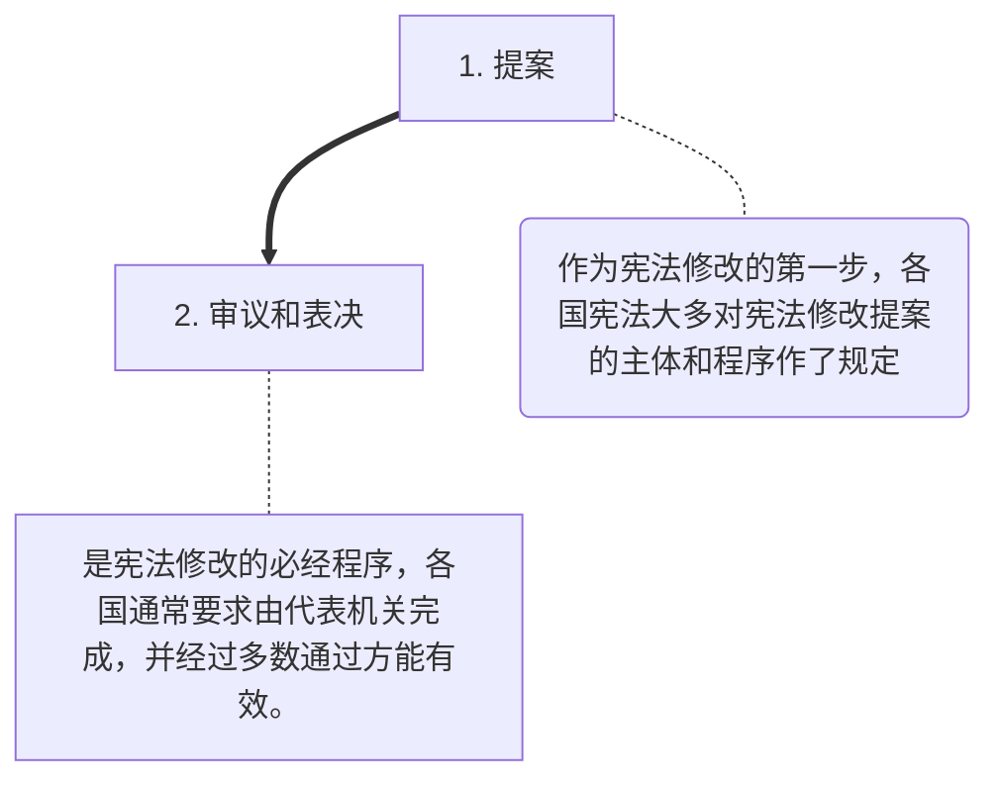

# 宪法学学习笔记(个人向)    Part.2
___
## 2. 宪法的制定和实施  

### 2.1 宪法制定

#### 2.1.1 宪法制定概述 
1. 宪法制定的概念  
    - ==宪法制定是指**制宪主体**行使制宪权的活动==；  
    - ==**制宪权**指人民创制宪法的权力==；  
    - 具体形式制宪权的是**立宪机关**，如制宪会议；  
    - **最早**系统提出宪法制定权概念及其理论体系的学者是法国大革命时期的==西耶斯==。他认为国民不受制于宪法，==国民拥有制宪权==；  
    > 【拓展】：  
    >   1. 在历史上，<u>君主、少数组织、特定团体</u>在一定条件下也可以成为制宪权的主体（`极少数情况下`）；  
    >   2. 事实上，**国民成为制宪权的主体这一概念是现代宪法的一个基本特征**。它是<u>近代宪法发展的结果，为现代各国宪法所普遍采用、确立</u>；
    >   3. **国民作为制宪权的主体，只能从抽象意义上来界定**，源于权利的享有主体，但在运行上难以做到全体国民直接参与制宪活动，来行使制宪权。**真正直接参与制宪活动的，只能是国民中的一部分人（`代表`）**。由他们代表国民行使制宪权。  

2. 制宪权与修宪权  
    - 制宪权、修宪权和立法权是属于**不同层次的权力形态**； 
    - ==制宪权是一种**原生性权力**==，在国家政权性质没有改变的情况下，<u>无论宪法进行怎么样的变化，无论是修改、解释还是其他的变迁形式，都不会导致制宪权的变化问题</u>；  
    - ==修宪权是一种**派生性权力**== ，是依据制宪权而生的。通常由宪法确定其行使的主体、程序和限制等方面的内容；  
    - ==立法权即制定一般法律的活动==。立法活动要遵从制宪权的宗旨，不能脱离制宪的目的和原则；  
3. 制宪机关和宪法的起草机关之间的区别  
    ||制宪机关|起草机关|
    |:---:|:---:|:---:|
    |机关产生|==选举产生==|==任命产生==|
    |机关设置|==常设的机关==|临时机关，完成起草后即宣告解散|
    |权力行使|行使**宪法制定权**的==国家机关==|专门的工作机构，不能独立行使制宪权|
    |权利效力|==有权==**批准**和**通过**宪法|==无权==批准和通过宪法|
4. 宪法制定的程序  
    1. 成立专门的制宪机构；  
    2. 提出宪法草案；  
    3. 通过宪法草案，草案成为正式的《宪法》（`一般要求代表机关以专门的、严格的程序予以通过`）；  
    4. 向全国公布宪法（`宪法通过后，一般是由国家元首予以公布`）。  

#### 2.1.2 中国宪法的制定   
1. 我国宪法的制宪主体：==中国人民==，**我国宪法是人民行使制宪权的产物**；  
    > 《共同纲领》在新中国成立初期起着临时宪法的作用。按照《共同纲领》的规定，**人民政协行使着一定范围的制宪权**；
2. ==我国宪法制定机关：第一届人大一次会议==（`1954年的`）；  

### 2.2 宪法解释   
- 概念：是指在宪法实施的过程中，**享有宪法解释权的国家机关**依照法定的程序对宪法的含义、内容和界限所作的**补充和说明**；  
- 根据宪法==解释主体的不同==，可将宪法解释分为（`这个分类类似于刑法的“有权解释”和“无权解释”`）：  
    1. 【==正式解释==】  
        - **享有宪法解释权的机关**对宪法作出的<font color=Red >具有宪法效力</font>的解释；  
    2. 【==非正式解释==】  
        - **有解释权之外的**机关或个人对宪法的解释；它反映了这些组织或者个人对宪法的理解。虽然<font color=Red >没有法律效力</font>，但反映了一国的宪法意识；  
- 宪法解释的方法：  
    1. ==文义解释==（`又叫`**字面解释**`，类比刑法的文理解释`）；  
    2. ==目的解释==（`又叫愿意解释，目的是`**探求制宪者的意图**`来解释宪法。它主要依据制宪过程中的历史资料来确定`）；  
    3. ==体系解释==（`根据宪法规范在宪法典中的位置，与其他规范的关联，`**从整体的角度**`来确定解释对象的含义、内容的解释方法,可以简单地视作联系上下文`）  

#### 2.2.1 宪法解释的体制<big><big>🌸</big></big>     
- ==宪法解释的体制属于**国家宪政**的组成部分==；因各国政治体制、历史传统和法律体系的不同而有一定的差异。  
- 差异主要来源于以下几点：  
    1. 立法机关解释体制  
        - **立法机关行使解释权源于英国**；  
        - 在本制度下，立法机关既是制宪机关，也是解释机关；  
        - 社会主义国家，一般由最高权力机关解释宪法。==我国的宪法解释权是由全国人大常委会行使==；  
    2. 司法机关解释体制  
        - **源自美国**，其他诸如加拿大、日本、澳大利亚等国家也采取了相同的制度；  
        - ==司法机关按照司法程序对宪法进行解释==，其他机关或者社会团体对宪法的解释属于非正式解释；  
        - 司法机关对于宪法的解释采用==不告不理==的原则，并**将宪法解释寓于审理案件的司法活动中**；  
        - 一般来说，该解释对审理的==某一特定案件具有法律效力==，不具有普遍的约束力；  
    3. 专门机关解释体制   
        - **源于奥地利**。目前，奥地利、德国、意大利、俄罗斯和韩国等建立了==宪法法院==，法国等建立了==宪法委员会==；  
        - 专门机关解释体制是依据宪法或者其他宪法性法律内容的**专门授权成立的机关**来行使宪法解释权的一种制度；  
        - ==具有专门性和权威性的特点==，在原理上能克服上述两种解释体制所存在的弊端，==将宪法解释的**司法性和专门性**有效的结合在一起==；  
    > 此外，在各国的实践中**还有其他不成文的司法解释**，有的具有约束力；有的虽然不具有法律上的约束力，但仍具有很大的影响。  

#### 2.2.2 中国宪法的解释                
1. ==中国宪法的解释属于立法机关解释体制==。**1978年宪法**对==由全国人大常委会进行司法解释==予以确认和建立；  
2. 这种解释体制的存在理由是：**常在 + 熟悉**：  
    1. 全国人大是国家最高权力机关，全国人大常委会是其常设机关。  
    2. 从一定的意义上讲，全国人大常委会比其他的国家机关更了解宪法的原意和精神，因此，这种解释体制**具备一定的合理性**；  
3. 存在的问题：  
    > ==缺乏具体的规范化程序==，还应当建立和完善一些具体的解释程序，将宪法解释进一步规范化；

### 2.3 宪法修改  
- 概念  
   > 是指**有权修改宪法的机关**依照法定的程序对宪法规范予以补充、调整、删除的行为，以保证宪法的内容与社会会发展现状相吻合，相适应；  
- 世界上实行宪政的国家都在宪法文本中确立了宪法修改的制度，并==规定严格而特别的程序==。一方面强调<u>宪法的稳定性</u>，另一方面也注重<u>宪法的发展性</u>；  
- **宪法修改条例本身也受到限制**，==有一些条文和内容不能成为宪法修改的对象==（`如：政体、基本权利等方面的内容`）。  
    > 法兰西第五共和国的《法国宪法》规定：“当宪法的修改有损领土完整时，任何修改程序都不得着手进行或继续进行。**政府的共和政体不得作为修改的议题**（`波拿巴主义者你就死心吧`）”   

#### 2.3.1 宪法修改的形式 
1. 【**全面修改**】  
    - 从1954年制定宪法开始，之后的75年宪法、78年宪法、82年宪法都是**对前一部宪法的全面修改**；  
    - ==全面修改并不意味着是对旧有宪法的全盘否定==；从主要形式上来看，旧宪法的许多内容仍然可以保留；  
    - 全面修改在宪政实践中==不经常使用==。一般是当国家出现某种特殊情况，旧宪法无法从总体上解决一些重大问题时，才会对宪法进行全面修改；  
2. 【**部分修改**】  
    - 部分修改是对宪法的**部分条款加以改变**，或者增加一些新的条款，而不改动其他条款的一种修改方法；  
    - 部分修改是一种比较灵活的宪法修改方式，==能够及时地反映国家政治、经济、文化等各方面的发展变化情况，又能保持宪法的确定性==，在宪政实践中具有明显的优越性；  
    - ==美国==自1787年宪法制定以来一直采用部分修改的方式，==用宪法修正案来完善宪法中存在的某些不足==。**我国目前也采用部分修改的方式**，<u>改变或增加一些条款，使宪法能够适应转型时期社会发展的需要</u>； 

#### 2.3.2 宪法修改的程序  

1. 我国宪法修改历程<big><big>🌸</big></big>   
    - ==一次制宪，三次全面修改，七次部分修改==；  
    - 1954年制定宪法，1975年和1978年全面修改，之后1979年和1980年两次部分修改，再之后1982年一次全面修改后固定下来成为**现行宪法**。最后从1982年开始，在1988年、1993年、1999年、2004年和2018年共五次做出部分修改，**通过了52条宪法修正案**；  
2. 我国宪法修改制度的内容<big><big>🌸</big></big>   
    1. 修改机关：==全国人大==；  
    2. 提案主体：==全国人大常委会==，或者==全体代表的 **2/3** 以上多数通过==； 
    3. 修改的通过程序：获得==全国人大全体代表总数 **2/3** 以上多数通过==；

### 2.4 宪法监督 

#### 2.4.1 合宪性审查制度  <big><big>🌸</big></big>
 1. 概述  
    - 原先名字叫“**违宪审查**”，后来改名后偏中性了；  
    - > 是指由**特定机关**==对立法行为以及其他行为进行审查并处理==的一种制度；  
    - 【注意】：  
        1. **立法行为既包括制定法律的行为，也包括制定法规和其他规范性文件的行为**；  
        2. 除立法行为以外，还应该包括对其他行为的审查，如==对行政行为的审查==；  
    - 原理  
        - 合宪性审查是基于宪法**作为高级法**而产生的。宪法不仅为制定其他法律提供依据，同时也作为一切行为的最高准则。**其他法律不得同宪法相抵触**；  
    - ==宪法解释和合宪性审查是密不可分的==；只有先出现宪法解释，后边的合宪性审查才能有理论依据；  

2. 模式  
    - 合宪性审查的模式取决于一个国家的政治、经济、文化条件和历史背景。
    - 不同的国家在模式的选择上会有一定的差异，大体包含以下几种：  
        1. 【==立法机关模式==】  
            1. 原因  
                - 在理论上可以追溯到**人民主权学说**。按照该学说，立法权是一种最高权力，**它是人民意志的体现**，执行权和其他权利必须处于从属的地位；  
                - 由于立法机关的最高地位，所以对立法机关制定的法律，其他机关无权进行审查，**立法机关自己制定的法律，是否违反宪法，只能由立法机关自己来审查**；  
            2. 局限性（`不考`）   
                - ==不能体现合宪性审查机构的专门性和裁判过程的司法性==，尤其是**无法解决自身监督自身立法的问题**；  
        2. 【==普通法院模式==】  
            - 最早由普通法院行使合宪性审查权的国家是==美国==；  
            - 虽然**美国宪法没有规定**普通法院有这项权力，但联邦最高法院在1803年的**马伯里诉麦迪逊案**中创立了合宪性审查的制度；  
            - 美国提出的合宪性审查制度对世界其他国家产生了重大的影响，其后<u>德国、日本、加拿大、澳大利亚、墨西哥、阿根廷</u>等国家也采用了这项制度；  
    
        3. 【==专门机关模式==】  
            - 早在1920年，**奥地利**就创立了**宪法法院**，其后<u>德国、波兰、西班牙</u>等国纷纷效仿。除此之外，<u>法国设立了宪法委员会</u>；  
            - 宪法法院是一种专门机关，体现了==司法性和专门性==相结合的特点；  
            - **专门机关模式体现违宪审查制度的发展趋势**，是一种较为合理的制度；  

3. 方式   
- 合宪性审查的方式可作为划分的标准：**一般审查 + 个别审查**、**抽象审查 + 具体审查**、**事前审查 + 事后审查**。以下详细介绍第三者：  
    1. 【==事前审查==】  
        - 也是一种预防性审查；  
        - 是法律、法规或者其他文件**在发生效力前**，或者**行为还没有实施前**，由特定的机关所作的一般性审查；  
        - 这种审查往往具有一种抽象性和非针对性，==并不是为了维护具体的利益==；  
        > 例如：需要批准才能生效的法律法规和政策；   
    2. 【==事后审查==】  
        - 是指法律、法规或者其他法律文件**在发生效力后**，或者**行为还没有实施前**，由==特定的机关所作==的审查；  
        - 这种审查具有针对性，==维护的是具体的利益==，在社会生活中影响较大；  
        > 例如：备案、改建、撤销等法律审查；  

#### 2.4.2 中国的宪法监督机制<big><big>🌸</big></big>  
> 在2023年，《立法法》对立法权限、法律位阶、法律监督等内容做出了修订；  
- 依据：宪法是最高法，在整个法律体系中具有最高的效力；  
- **监督机关**：==全国人大和全国人大常委会==；  
  **具体负责机关**：==全国人大各专委会==；  
- 审查过程：与按照《立法法》对法律进行审查的步奏相同：  
    1. 被动审查的对象：行政法规、地方性法规、自治条例和单行条例；  
    2. 被动审查的提起包括 **审查要求 + 审查建议**；  
    3. 对于审查的处理，各专委会或者常委会工作机构发现问题，可以：  
        1. 给制定机关一些书面的意见建议；  
        2. 把制定机关叫过来，再给一些书面的意见和建议； 
    4. 制定机关拿到意见建议后**2个月内**要给回复，改了审查终止；没改，通过委员长会议找到全国人大常委会，让它来进行最终处理，此间还有其他的反馈和公开情节；  
> Q：主观题关于中国宪法监督制度怎么完善怎么答？
> A：和在国/省考中的答法一样，**问题，措施，成效**，或者是**问题是什么+辩证地看待问题+我们需要怎么做来肯定积极，否定消极**；
> - 具体问题包括（**缺抽分**）：  
>       1. ==合宪性审查权行使过于**分**散==；  
>       2. ==对法律、规章等法律形式如何进行合宪性审查**缺**乏明确的规定==；  
>       3. ==关于合宪性审查的启动程序、审理程序和审理结果等方面的规定相对比较**抽**象==；  
> - 所以完善途径是：<u>要建立能够真正维护国家法制统一、约束政府权力、保障公民自由的**宪法监督机制**</u>；

##### 2.4.2.1 宪法法律   
1. 立法权限  
    1. 宪法  
        - 国家机构的分类  
            ```mermaid
            graph LR
            A((国家机构))---A1[立法机关]==>B1[全国人大：国家最高权力机关]  
            A1[立法机关]==>B2[全国人大常委会：国家最高权力机关的常设机关] 
            A((国家机构))---A2[行政机关]==>B3[国务院（中央人民政府）]  
            A((国家机构))---A3[司法机关]==>B4[最高人民法院 + 最高人民检察院] 
            A((国家机构))---A4[监察机关]==>B5[国家监察委]  
            A((国家机构))---A5[军事机关]==>B6[中央军委（1982年开始）]  
            A((国家机构))---A6[国家主席]==>A7[国家主席 + 国家副主席]
            ```   
        - 宪法是我国的根本法(`狭义上的`),在我国法律体系中居首要地位，具有最高的法律效力；  
        - 制定和修改上文已经介绍过了。  
    2. 法律  
        - 法律由于**制定机关**的不同分为两大类：  
            |机构名称|具体事项|
            |:---:|:---|
            |全国人大|【1】==制定基本法律==，如刑事、民事、国家机构和其他基本法律；<br>【2】==可以授权全国人大常委会制定相关法律==；|
            |全国人大常委会|【1】==制定除基本法律以外的其他法律==；<br>【2】在全国人大闭会期间，全国人大常委会也有权对全国人大制定的法律在**不与该法律基本原则相抵触**的条件下==进行部分补充和修改==|  
        - 关于全国人大可以授权常委会立法的相关条款**新增于2023年的《立法法》**。例如：`2020年5月全国人大通过决议，授权全国人大常委会就建立健全全香港的特别行政区维护国家安全的法律制度和执行制度制定法律`；  
2. 法律保留   
    >  “保留”指保留给政府/特定机关的内容；
    1. 【==绝对保留==】  
        - 只能制定法律来代表的；  
        - ==全国人大 + 全国人大常委会参与==；  
        - 包含:  
            1. 对公民**政治权利**的剥夺；  
            2. 限制**人身自由**的强制措施和处罚；  
            3. 诉讼和仲裁的==基本制度==（**司法制度**）；  
                > 近年来，为推进更高水平的对外开放，国家支持部分地区建设国家商事仲裁中心试点。如：深圳、珠海探索建立国家仲裁院并出台国际仲裁院条例，有的自由贸易区探索建立临时仲裁制度等。上述实践探索无法完全适用仲裁法等法律的规定，有必要在立法权限上为地方制定相应的仲裁制度规则**留下空间**（`直接使用《仲裁法》的规定将是不允许的`）。   
            4. **犯罪与刑罚**；  
            > 简称为==政人诉罪==，；  
    2. 【==相对保留==】  
        - 原则上也应当制定法律的，但尚未制定法律的，<u>全国人大及其常委会</u>有权作出决定，**授权**==国务院==**可以根据实际需要**，==对其中的部分事项先制定行政法规==；  
        - > 又叫做“==授权立法==”；  
        - 授权决定**应当明确授权**目的、事项、范围、期限以及实施授权决定**应当遵守的原则**；  
        - ==授权期限不得超过 **5** 年==，但是授权决定另有规定的除外。  
        - <u>被授权机关**应当**在授权==期限届满的6个月以前==，向授权机关报告授权决定实施的情况</u>，并提出是否需要制定有关法律的意见；需要继续授权的，可以提出相关意见，==由全国人大及其常委会决定是否延期授权==；  
        - 被授权机关**应当**严格按照授权决定行使被授予的权力，==被授权机关不得将授权效力转授给其他机关==；  
        - > 可授权的内容包括但不限于：  
          >  1. 国家主权的事项；  
          >  2. 各级人大、人民政府、监察委员会、人民法院、人民检察院的产生、组织和职权；  
          > 3. ==民族区域自治制度==、特别行政区制度、基层群众自治制度；  
          > 4. ==民事基本制度==、==基本经济制度==以及财政、海关、金融和外贸的**基本制度**；  
          > 5. ==对非国有财产的征收、征用==；  
          > 6. 税种的设立、税率的确定和征税收的征收管理等==税收基本制度==；  
        - 授权立法事项，经过实践检验，制定法律的条件成熟时，由全国人大及其常委会及时制定法律。==法律制定后，相关立法事项的授权终止==；  
        - 全国人大及其常委会可以根据**改革发展**的需求，决定就**特定事项**授权在**规定时限及范围**内==暂时调整或者暂时停止适用**法律的部分规定**==。暂时调整或者暂时停止适用法律的部分规定的事项，==实践证明可行的==，由全国人大及其常委会及时修改有关法律；==修改法律的条件不成熟的==，<u>可以延长授权期限，或者直接恢复原有相关法律规定</u>(`非常灵活既实用的政策套路，我授权你们搞试点，搞得好我中央就推行全国，推行完了就收回搞试点的权力；搞不好就延长授权时间接着搞，再搞不好说明现在的条件不成熟，就先不搞，恢复原有的制度`)；  
3. 立法程序  
    - 即法律草案的 **==提出== + （审议）`法硕不考` + ==表决与通过== + 公布**；  
    - 各个阶段程序通过的条件：  
        ||提出|表决与通过|公布|
        |---|:---:|:---:|:---:|  
        |全国人大|==两央、两高、三委、两团、**30**代表联名==|全体代表的**过半数**通过|国家主席签署主席令|
        |全国人大常委会|==两央、两高、三委、**10**常委联名==|常委会全体组成人员**过半数通过**|国家主席签署主席令|  
        > 1. 两央：国务院（`中央人民政府`）、中央军委；  
        > 2. 两高：最高人民法院、最高人民检察院；  
        > 3. 三委：国家监察委、全国人大各专委（`共10个`）、全国人大常委；  
        > 4. 两团：全国人大主席团、一个以上代表团（`2+4+5+23+1=35，即2个特别行政区+4个直辖市+5个自治区+23个省+解放军`）；  
    - 与全国人大及其常委会有关的程序：  
       1. 向全国人大提起法律草案  
            > 两央、两高、三委、两团、**30**代表联名；  
       2. 向全国人大常委会==提起法律草案==  
            > 两央、两高、三委（国家监察委、**全国人大专委**、**委员长会议**`(全国人大常委会的“主席团”)`）、**10**常委联名；  
       3. ==向全国人大常委会提起法律解释==  
            > 两央、两高、三委（**监察委、全国人大各专委、省级人大常委**）；  
       4. 向全国人大常委会==提起法律审查要求==  
            > 两央、两高、==两委==（**监察委和省级人大常委**） 

4. 法律解释  
    |机关|全国人大常委会|
    |:---:|:---:|
    |情形|【1】法律的制定**需要进一步的解释**以明确具体含义（`理论`）；<br>【2】法律的制定后出现新的情况，**需要明确适用的法律依据**（`实践`）|
    |提出|==两央、两高、三委==|
    |通过|常委会全体组成人员**过半数通过**|
    |公布|由**常委会**发布公告予以公布|
    |效力|全国人大常委会的==法律解释与法律具有同等效力==（`立法解释`）|

##### 2.4.2.2 行政法规  
  1. 制定机关：==国务院==；  
  2. 行政法规的名称：**xx条例、xx规定、xx办法**。根据相对保留的原则，一般情况下国务院对自己的授权==只保留5年==。故国务院根据授权决定制定的行政法规，称为**暂行条例**或**暂行规定**；  
  3. 公布：  
       1.  一般情况下，==总理签署国务院令予以公布==；  
       2.  有关国防建设的行政法规，<u>可以由国务院总理、中央军委主席==共同签署==**国务院、中央军委令**</u>公布（`1982宪法规定行政和军事部门采取“首长负责制”`）；      
  4. 改变适用：  
     > **国务院**可以根据改革发展的需要，决定就<u>行政管理等领域</u>特定事项，在规定期限和范围**暂时调整或者暂时停止适用**行政法规的**部分规定**；   

##### 2.4.2.3 地方性法规   
1. 各级政府的分类   
    > 1. ==民族自治地方只包括自治区、自治州、自治县==，不包括下边的民族乡。  
    > 2. ==我国基本行政区划只包括省、县、乡==，市是后创的，属于从县中独立出来的，不包括在内；  
    > 3. 尤其要注意“市”的行政级别。**直辖市省级，设区管县的市市级，不设区的市县级**。当然还有一个例外就是东莞市。它是市级行政单位但是下边只有镇，镇充当了区的作用。
2. 地方性法规的制定机关  
    1. ==省级人大及其常委会==（`包括省、自治区、直辖市`）；  
    2. ==受限制的市级人大及其常委会==（`包括设区的市和自治州`），其限制包括：  
        1. 需要报送省级常委会（`省、自治区`）**批准后施行**；  
        2. **制定范围存在限制**，只限于<u>**基**层治理、**历**史文化保护、**生**态文明建设、**城**乡建设与管理（口诀：==激励生成==）</u>；  
    > 【注意】：要==明确区域协同立法==，省级和市级人大及其常委会可以根据区域协调发展的需要，**协同制定地方性法规**，在本行政区或者有关区域内实施；    
3. 地方性法规的名称  
    - **xx条例、xx规定、xx规则、xx办法**等；  
    - 很明显名字听起来和国务院制定的全国性法规很像。所以区分很重要。通常区分是全国性法规还是地方性法规，看**制定机关是什么级别的**；  

##### 2.4.3.4 地方政府规章  
1. 制定机关  
    1. **省级政府**；  
    2. 受限制的**市级政府**  
        > 限制内容：制定范围仅限于==激励生成==（`基层治理、历史文化保护、生态文明建设、城乡建设与管理`）；  
2. 设定范围  
    没有上位法依据，地方政府规章==不得设定减损==公民、法人和其他组织==权利==，或者==增设==其==义务==的规范；  
3. 临时规范  
    - 应当制定地方性法规但条件尚不成熟的，或者因行政管理迫切需要，**可以先制定地方政府规章**。规章实施**满2年**需要继续实施规章所规定的行政措施的，**应当**提请本级人大或者其常委会制定地方性法规。  

> 地方性法规与地方政府规章的区别：  
> ||地方性法规|地方政府规章|
> |:---:|:---:|:---:|
> |制定机关的差异|==省市两级的人大及其常委会==|==省市两级的政府==|
> |制定限制的差异|**市一级的法规需要上报到省一级批准后实施**|/|  

>  地方性法规与地方政府规章的区别的相同点：==市一级的单位制定范围都有限，即**激励生成**==（`基层治理、历史文化保护、生态文明建设、城乡建设与管理`）。   

 
##### 2.4.3.5 民族自治法规  
1. 类型  
    |类别|内容|
    |:---:|:---:|
    |==自治条例==|一种**综合性法规**，内容比较广泛|
    |==单行条例==|有关于**某一方面事务**的规范性文件|  
2. 制定机关：==民族自治地方的人大==，切记<big>**没有人大常委会**</big>；  
    |机关名称|如何生效|
    |:---:|:---:|
    |自治区人大|**报全国人大常委会**批准后生效|
    |自治州人大|**报省级人大常委会**批准后生效|
    |自治县人大|==报省级人大常委会==批准后生效|  
3. 内容     
    - 自治条例和单行条例可以按照当地民族的特点，对法律和行政法规（`全国性的`）==做出变通规定==；  
    - 【注意】：以下情况不允许变通：  
        1. 不得变通宪法；  
        2. ==不得违背==法律或者行政法规的==基本原则==（`具体落实的细节可以变`）；  
        3. 不得变通民族区域自治法的规定和其他法律、或者**行政法规==专门==就民族自治地方==作出的规定==**；  
4. 名称  
    - 一般采用 **“条例”、“规定”、“变通规定”、“变通办法”** 等称呼；  

> 总结1： 经批准生效的情形总结 
> 1. 自治区人大制定的**自治条例和单行条例**报全国人大常委会批准后生效；  
> 2. 自治州、自治县人大制定的**自治条例和单行条例**报省级人大常委会批准后生效；  
> 设区的市、自治州人大及其常委会制定的**地方性法规**报省、自治区人大常委会批准后生效；   

> 总结2： 民族自治地方的立法
> ||自治条例、单行条例|地方性法规|地方性政府规章|
> |:---:|:---:|:---:|:---:|
> |【制定机关】 👉️|人大|人大及常委会|政府|
> |自治区|✅，报全国人大常委会批准后生效|✅|✅
> |自治州|✅，报省级人大常委会批准后生效|✅，报省级人大常委会批准后生效，只限于==激励生成==|✅，报省级政府批准后生效，只限于==激励生成==|
> |自治县|✅，报省级人大常委会批准后生效|❌|❌|  


##### 2.4.3.6 特别行政区的法律  
- > 特别行政区内实行不同于全国其他地区的经济、政治、法律制度，即在若干年内保持原有的资本主义制度和生活方式——“==一国两制==”的构想；  
- 全国人大已于==1990年通过了《香港基本法》==、==1993年通过了《澳门基本法》==（`全国人大制定的基本法律，制定和修改都是由全国人大负责`）;
- ==香港基本法和澳门基本法的修改单位只能是全国人大==，常委会不行；  
- 特别行政区的 **立法机关（立法会）** 享有自己的专属立法权，可以根据《基本法》的规定，制定、修改和废除法律。特别行政区的立法机关制定的法律**须报全国人大常委会备案**，且==备案不影响法律生效==；（`即享有的高度自治权`）；  

##### 2.4.3.7 部门规章  
1. 制定机关  
    > 国务院各部、委员会、**中国人民银行**、审计署和具有行政管理职能的直属机构以及**法律规定的机构**；  
2. 设定范围  
    - 在没有法律或者国务院法规、决定、命令时充当办事**依据**；  
    - 要求必须做到：  
        1. 不得设定减损公民、法人或者其他组织权利的规范；  
        2. 不得设定增加公民、法人或者其他组织义务的规范；【==不得损人==原则】  
        3. 不得增加本部门的权力或者减少本部门的法定职责；【==不得利己==原则】  
    - 【注意】：**涉及到两个以上国务院部门职权范围的事项，应当提请国务院制定行政法规，或者由国务院有关部门联合制定规章**；【遇到冲突，==仲裁权上移==】  

##### 2.4.3.8 监察法规  
1. 概述  
    > 监察法规是==国家监察委员会==根据**宪法法律**指定的一种法规；  
2. 监察法规可以就以下事项作出规定： 
    1. **为执行法律的规定**，需要指定监察法规的事项；  
    2. **为履行地方各级监察委员会工作职责**，需要指定监察法规的事项；  
3. ==监察法规不得与宪法、法律相抵触==；  
4. 监察法规应当==经国家监察委员会全体会议决定==，由**国家监察委员会发布公告**予以公布（`集体负责制`）；  
5. 监察法规应当在公布后的 **30日内** ==报全国人大常委会备案==；  

##### 2.4.3.9 军事法规与规章  
1. 制定机关：  
    1. ==中央军委==：根据宪法和法律，制定**军事法规**；  
    2. ==中央军委各职能部门、各战区、各军兵种、武警部队==：可以根据法令与军事法规、决定、命令制定军事规章；  
2. 军事法规、军事规章在**武装力量内部实施，在军事法院、军事检察院适用**；    

> 总结3： 法律规范的公布总结  
> |法律规范名称|公布程序|
> |:---:|:---|
> |法律|全国人大或者其常委会通过后，==由国家主席签署主席令予以公布==|
> |法律解释|==由全国人大常委会发布公告予以公布==|
> |行政法规|【1】==总理签署国务院令==；<br>【2】有关国防建设的行政法规，由**国务院总理、中央军委主席**==共同签署国务院、中央军事委员会令==的形式予以公布|
> |地方性法规和民族自治法规|【1】省级人大制定的地方性法规==由省级人大主席团发布==公告予以公布；<br>【2】省级人大常委会制定的地方性法规==由省级人大常委会发布==公告予以公布；<br>【3】设区的市、自治州的人大及其常委会制定的地方性法规报准后，==由设区的市、自治州的人大常委发布==公告后予以公布（`经批准时间比较长，人大早散会了，所以交由常委会发布`）；<br>【4】自治条例和单行条例报经批准，分别由==自治区、自治州、自治县的人大常委发布==公告予以公布（`同样的道理，经批准完都散会了，只能找人大常委会公布`）；|
> |部门规章|==部门首长签署命令==予以公布|
> |地方政府规章|==由省市级政府首长签署命令==予以公布（`首长是xx长或者xx区主席，不是党政的x委书记`）|   

> 【注意】：
> 1. 部门规章由**部务会议**,或者**委员长会议**决定；  
> 2. 地方政府规章应当经**政府常务会议**或者**政府全体会议**决定；  

> 总结4： 公布方式（`文本、草案的说明、审议结果报告等`）  
> ||纸质|电子|
> |:---:|:---|:---:|
> |法律|【1】==全国人大常委会公报==；<br>【2】在全国范围内发行的报纸；|[中国人大网](http://www.npc.gov.cn/)|
> |行政法规|【1】国务院公告；<br>【2】在全国范围内发型的报纸；|[中国政府法制信息网](https://www.chinalaw.gov.cn/)|
> |地方性法规与民族自治法规|【1】==地方人大常委会公报==；<br>【2】本行政范围内发行的报纸|[中国人大网](http://www.npc.gov.cn/)、本地方人大网站|
> |部门规章|【1】国务院公报或者部门公报；<br>【2】全国范围内发行的报纸|[中国政府法制信息网](https://www.chinalaw.gov.cn/)|
> |地方政府规章|【1】本级人民政府公报；<br>【2】本行政区域报纸；|[中国政府法制信息网](https://www.chinalaw.gov.cn/)|  

> 【注意】：  
> 1. 自2023年《立法法》进行修改后，法律规范不仅仅要公布原文的文本，还需要公布**草案的说明、审议结果报告**；  
> 2. 行政机关制定的法律规范电子版基本都能在[中国政府法制信息网](https://www.chinalaw.gov.cn/)查到；

#### 2.4.3 当代中国法的位阶<big><big>🌸</big></big>  
1. 不同位阶的法的渊源之间的冲突  
    1. **宪法**具有最高的法律效力；  
    2. **法律**的效力高于行政法规、地方性法规、规章；  
    3. **行政法规**的效力高于地方性法规、规章；  
    4. **地方性法规**的效力高于本级或者下级地方政府规章；  
    5. ==上级政府制定的规章的效力高于本行政区域内下级政府指定的规章==；  
    6. **自治条例和单行条例**==依法作变通规定==； 
    7. **经济特区法规**==授权作变通规定==；  
        > 经济特区所在地的省、市的人大及其常委会根据**全国人大的授权决定**（`相对保留`），制定法规，并在经济特区范围内实施。  

2. 关于上文的补充 
   > 【我国让人民当家作主的方式】：  
   > 人民选出人大代表，从而产生各级人大；各级人大产生其他国家机关并制定法律；其他国家机关对人大负责，人大对人民负责。一般情况下，人大不在的时候，人大常委会代行人大的部分权利，其他国家机关向人大常委会负责。  

   > 【注意】：一般的职权排序是$$省法规>市法规\\省规章>市规章$$
   > 但是，上述是根据《立法法》规定的内容。在《立法法》中**并没有说明“省规章”和“市法规”之间的职权大小**，由于法硕考试只考察《立法法》中的相关内容。==故此处争议搁置不谈==，以增笑料耳。  

3. 同一位阶的法的渊源之间的冲突  
    1. **同一机关**制定的法律规范，特别规定与一般规定发生冲突，==适用特殊规定==；新规定与旧规定不一致，==适用新规定==；  
    2. 同一机关制定的**新的一般规定与旧的特殊规定之间发生冲突**，==交由制定机关裁决==，其中；
        1. 法律交由**全国人大常委会**裁决；  
        2. 行政法规交由**国务院**裁决；  
    3. - ==部门规章之间具有同等效力，部门规章与地方政府规章之间具有同等效力==（`部门规章是指中央的，这里地方政府规章分为省级、市级两级。在特殊事项上，不管是省一级还是市一级的综合性规章，它具体的某一方面与部门规章之间就是同等级效力的，说法类似于并集与参考集等价`），在各自的职权范围内施行；  
            ```mermaid
            graph LR             
            subgraph 中央机关           
                B[部门规章] 
            end
            subgraph 省级政府规章  
                subgraph 市级政府规章  
                    A[某一具体事项]<-->|具有同等效力|B[部门规章]
                end  
            end 

            ```   
        - <u>部门规章之间、部门规章与地方政府**规章**对同一事项之间发生冲突</u>，==交由国务院裁决==；  

4. 位阶出现交叉时法的渊源之间的冲突  
    1. 地方性**法规**与部门规章之间对同一项事项发生冲突，不能确定如何适用时，**应由国务院提出意见**：  
        1. 国务院认为应该适用地方性法规的，应当决定在该地方适用地方性法规；  
        2. 国务院认为应当适用部门规章的，==应当提请全国人大常委会裁决==（`为防止徇私，需要更高层裁决`）；  
    2. 根据授权制定的**法规**与**法律**规定不一致，不能确定如何适用时，**由全国人大常委会裁决**；  

> 总结5：各法律、法规、规章发生冲突时的解决办法：  
> 1. $效力上：宪法>法律>行政法规（中央）>地方性法规>地方政府规章$  
> 2. |发生冲突的内容|发生冲突的部门|解决办法（`裁决办法`）|
>    |:---:|:---:|:---:|
>    |特别规定与一般规定|同一机关|==适用特殊规定==|
>    |新的规定与旧的规定|同一机关|==适用新的规定==|
>    |**法律之间**<u>新的一般规定</u>和<u>旧的特殊规定</u>|同一机关|**全国人大常委会裁决**|
>    |**行政法规之间**<u>新的一般规定</u>和<u>旧的特殊规定</u>|同一机关|**国务院裁决**|
>    |**部门规章之间**|不同部门（`中央`）|**国务院裁决**|
>    |部门规章与地方政府规章|中央部门与地方政府|**国务院裁决**|
>    |部门规章与地方性法规|中央部门与地方政府|【1】国务院认为地方对的，直接按照地方实行；<br>【2】国务院认为中央部门对的，==需要再报请==**全国人大常委会裁决**| 
>    |**授权制定的法规**与**法律**|中央部门和立法机关|**由全国人大常委会裁决**|  

#### 2.4.5 我国法律的监督机制<big><big>🌸</big></big>  
- 简称为 **事先审查 + 事后审查**；    
1. 事先审查  
    - 比较综合型的审查，不保护具体的利益；  
    - 需要事先经过批准的3种情形：  
        1. 自治区人大制定自治条例和单行条例时，需要报全国人大常委会批准后生效；  
        2. 自治州、自治县人大制定自治条例和单行条例时，需要报自治区人大常委会批准后生效；  
        3. ==设区的市、自治州人大及其常委会制定地方性法规时，须报请省、自治区人大常委会批准后生效==；  
2. 事后审查  
    - 即：**备案 + 改变或撤销 + 法律审查**；     
    1. 【备案】  
        1. 备案的原则  
            1. **人大不接受备案**；  
            2. ==法律最高备案到全国人大常委会，规章最高备案到国务院==；  
            3. ==经过批准的，由批准机关向上备案==（**所有规章都不需要经过批准**<big><big>🌸</big></big>）；  
        2. 备案图示  
            ```mermaid
            graph BT
            subgraph 立法机关  
                A1[全国人大常委会]  
                A2[省级人大常委会]
                A3[市级人大常委会]
            end
            subgraph 行政机关  
                B1[国务院]  
                B2[省级政府]  
                B3[市级政府]==>A3[市级人大常委会]==>B2[省级政府]==>A2[省级人大常委会]==>B1[国务院]==>A1[全国人大常委会]
            end
            ```  
        3. 如何确定向谁备案？<big><big>🌸</big></big>  
            1. 先确定是否需要经过批准；  
            2. 在备案图示中定位谁来向上提交；  
            3. 明确要备案的是法规还是规章；  
            4. 明确完毕后，从向上备案的单位开始直至备案终点，**沿途遍历的部门都要备案一次**(`由于自治区的自治条例和单行条例需要得到全国人大常委会批准，故备案终点与批准单位为同一个，故不需要再备案了；同理，部门规章只用到国务院备案一次就结束了`)；  
            5. 备案法条  
                > 《立法法》第109条规定，行政法规、地方性法规、自治条例和单行条例、规章应当在公布后的 ==**30日内**== 到有关机关备案。   
    2. 改变或撤销  
       1. 根据《立法法》第107条，需要改变或撤销的情形：  
            1. 超越权限的；  
            2. 下位法违反上位法规定的；  
            3. 规章之间对同一事项的规定不一致，经裁决**应当改变或者撤销一方的规定**的；  
            4. 规章的规定被认为不合适，应当改变或撤销的；  
            5. **违背法定程序的**；  
        2. 改变或撤销的原则<big><big>🌸</big></big>  
            1. ==单位存在领导关系，改变或撤销==（`包括：人大对同级人大常委、上级政府对下级政府`）  
            2. ==单位存在监督关系，只撤销不改变==（`包括：立法机关对行政机关、上级立法机关对下级立法机关`）；  
            3. 人大只能管自己的常委会；常委会可以管同级政府和下一级人大及常委会；政府只能管自己的工作部门和下一级政府，其结构如图所示：  
                ```mermaid
                graph TB
                A[人大]==>|领导|B[人大常委会]==>|监督|C[政府]==>|领导|D[政府工作部门]  
                B[人大常委会]===>|监督|E[下一级人大及其常委会]  
                C[政府]===>|领导|F[下一级政府]
                ```
                > 简单总结是：   ==人大常委会只能监督，政府只能领导==。  
            4. ==自治区的自治条例和单行条例只能由全国人大撤销==，==自治州或自治县的自治条例和单行条例只能由全国人大常委会撤销==；  
                > 补充：【民族自治地方自治法规的参与机关】  
                > ||制定机关|批准机关|备案机关|撤销机关|
                > |:---:|:---:|:---:|:---:|:---:|
                > |自治区|人大|全国人大常委会|**无需备案**|**全国人大**|   
                > |自治州、自治县|人大|省级人大常委会|国务院、全国人大常委会|**全国人大常委会**|
            5. 改变或撤销的具体法条，出现在《立法法》第108条：  
                > 省、自治区、直辖市的人民代表大会及其常务委员会可以根据本地区的具体情况和实际需要，在不同宪法、法律、行政法规相抵触的前提下，制定地方性法规。  
                >    
                > 其中==授权机关`（立法机关）`与被授权机关`（行政机关）`之间的关系是**监督关系**==，例如全国人大常委会和国务院，或者全国人大常委会与地方政府。

    > 总结6： 人大、人常、政府之间的改变、撤销关系<big><big>🌸</big></big>  
    > ```mermaid
    > graph TB  
    > subgraph 中央立法机关   
    >   A[全国人大]
    >   B[全国人大常委会]
    > end  
    > subgraph 省级立法机关   
    >   D[省级人大]
    >   E[省级人大常委会]  
    > end
    > A[全国人大]==>|改变或撤销|B[全国人大常委会]==>|撤销|C[国务院]
    > D[省级人大]==>|改变或撤销|E[省级人大常委会]==>|撤销|F[省级政府]  
    > B[全国人大常委会]===>|撤销|D[省级人大]  
    > B[全国人大常委会]==>|撤销|E[省级人大常委会]  
    > C[国务院]====>|改变或撤销|F[省级政府]  
    > F[省级政府]==>|改变或撤销|G[市级政府]  
    > C[国务院]==>|改变或撤销|G[市级政府]
    > subgraph 市级立法机关  
    >   X[市级人大]
    >   Y[市级人大常委会]  
    > end
    > X & Y==>|撤销|G[市级政府]
    > ```  
    > 这里**市级人大领导不了市级人大常委会**是因为市级人大常委会制定的地方性法规需要得到省级人大常委会的批准后生效，权力来源于省级人大常委会而不是市级人大。市级人大也没资格干预地方性法规在省里的通过。所以事实上市级人大无法实际领导市级人大常委会。
       
    3. 法律审查  
        - 我们先来看法条表述：  
            1. 《立法法》第110条（`被动审查`）  
                > 1. **国务院、中央军委、国家监委、最高人民法院、最高人民检察院、各省级人大常委会（4+5+23）** 认为<u>==行政法规、地方性法规、自治条例和单行条例==</u>同宪法或者法律相抵触，或者存在和合宪性、合法性的问题，可以向**全国人大常委会**==书面提出审查【要求】==，由全国人大有关的**专委、常委的工作机构**进行审查并提出意见；  
                > 2. 除前款所提的机关以外的国家机关、社会团体、企业、事业单位或个人（`公民`）认为<u>==行政法规、地方性法规、自治条例和单行条例==</u>同宪法或者法律相抵触的，可以向**全国人大常委会**==书面提出进行审查【建议】==，由全国人大**常委会工作机构**进行审查；在必要时，送有关的**专委**进行审查并提出意见；  

            2. 《立法法》第111条（`主动审查`）  
                > 1. **全国人大专委、常委的工作机构**可以对报送备案的==行政法规、地方性法规、自治条例和单行条例==等进行【**主动审查**】，并可以根据需要进行【**专项审查**】；  
                > 2. **国务院备案审查工作机构**可以==对报送备案的==地方性法规、自治条例和单行条例、部门规章、省级人民政府制定的规章进行【**主动审查**】，并可以根据需要进行【**专项审查**】（`无所不审，无所不查`）；  
        - 如果在审查时真的发现问题，则需要按照以下情况进行处理：  
            1. 《立法法》第112条  
                > 1. **全国人大专委、常委的工作机构**在审查中认为行政法规、地方性法规、自治条例和单行条例同宪法或者法律相抵触，或者存在合宪性、合法性问题，可以【1】==向制定机关提出书面审查意见==，也可以【2】==由宪法与法律委员会与有关的专委、常委的工作机构召开**联合审查会议**，要求制定机关**到会说明情况**，再向制定机关提出书面审查意见==制定机关应当在**2个月内**研究提出是否修改或者废止的意见，并向全国人大宪法和法律委员会、有关的专委或者常委工作机构==反馈==；  
                > 2. 全国人大宪法与法律委员会、有关的专委、常委的工作机构根据前款规定，向制定机关提出审查意见，制定机关按照所提意见对行政法规、地方性法规、自治条例和单行条例==进行修改或者废止的，审查终止==；  
                > 3. 全国人大宪法与法律委员会、有关部委、专委的工作机构经审查认为行政法规、地方性法规、自治条例和单行条例同宪法或者法律相抵触，或者存在合宪性、合法性问题需要修改或者废止，但**制定机关不予修改或者废止的**，应当==向人大委员长会议提出予以撤销的议案、建议，由人大委员长会议决定提请人大常委会会议审议决定==（`主席团是全国人大的主持机关，委员长会议是全国人大常委会的主持机关`）；    
        - 反馈公开原则，即《立法法》第113条：  
            > 全国人大有关的专委、常委工作机构应当按照规定要求，==将审查情况==向提出审查提议的国家机关、社会团体、企事业单位以及公民==反馈，并可以向社会公开==；  

> 总结7： 审查的提起 
>   
> |审查方式|主体内容|
> |:---:|:---|
> |被动审查|【1】审查的对象：==行政法规、地方性法规、自治条例和单行条例==（`为什么缺乏其他，因为立法法不完善，权力阻绊太多`）；<br>【2】审查的接受主体：**全国人大常委会**；<br>【3】审查的提起方式：==书面形式==；<br>【4】审查**要求**的提请主体：==两央、两高、监察委、各省级人大常委会==，并交由全国人大相关的专委、常委工作机构进行审查、提出意见；<br>【5】审查**建议**的提起主体：<u>==其他国家机关、社会或团体、企事业单位`（企业事业组织）`以及公民==</u>，并由**常委会**工作机构进行审查；必要时，交由相关的**专委会**进行审查、提供意见|
> |主动审查|【1】==全国人大专委会、常委会工作机构==可以对报送备案的<u>行政法规、地方性法规、自治条例和单行条例</u
> >等进行**主动审查**，并可以根据需要对其进行**专项审查**；<br>【2】==国务院备案审查工作机构==可以对报送备案的<u>地方性法规、自治条例和单行条例、部门规章和地方政府规章</u>进行**主动审查**|  

> 总结8：审查的处理  
> 抵触或者存在合宪性、合法性问题，可以：  
> 1. 直接向制定机关提出==书面审查意见、研究意见，也可以召开联合审查会议，要求制定机关到会说明情况，再向其提出书面审查意见==；  
> 2. 制定机关**应当在2个月内**研究出是否修改或者废止的意见，并==进行反馈==；  

> 总结9： 审查的结果  
> 1. 制定机关修改或废除，审查终止；  
> 2. 制定机关不修改或者废除，应当向**委员会会议提出予以撤销的议案、建议，由委员会会议决定提请常委会会议审议决定**；  

> 总结10： 审查公开  
> 向提出审查建议的国家机关、社会团体、企业事业组织以及公民**反馈**审查、研究**情况**，并且可以**向社会公开**；  

> 【注意】：在2023年《立法法》修订中，提出==建立健全全备案审查衔接联动机制==，对应当由其他机关处理的审查要求或者审查建议，==应及时移交有关机关处理==；

#### 2.4.6 《监督法》中对司法解释同法律规定相抵触的审查规定
1. 第31条  
    > **最高人民法院、最高人民检察院**作出的属于审判、检察工作中具体应用法律的解释，应当==自公布之日起30日内==报全国人大常委会备案；
  
2. 第32条  
    > 1. **国务院、中央军委、省级人大常委会**认为<u>最高人民法院、最高人民检察院</u>做出的具体应用到法律的**解释同法律规定相抵触**的，可以==向全国人大常委会书面提出审查的要求==，由常委会的工作机构送有关**专委会**进行审查、提出意见；  
    > 2. 前款规定<u>以外的其他国家机关和社会团体、企业事业单位以及公民</u>认为最高人民法院、最高人民检察院做出的具体应用法律的**解释同法律规定相抵触**，可以==向全国人大常委会书面提出进行审查的建议==，由常委会工作机构进行研究，**必要时，送有关专委会**进行审查、提出意见；  

3. 第33条  
    > **全国人大宪法与法律委员会和有关的专委会**经审查认为最高人民法院或者最高人民检察院作出的具体应用法律的**司法解释同法律规定相抵触**，而最高人民法院或者最高人民检察院**不予修改或者废止的**，可以==提出要求最高人民法院或者最高人民检察院予以修改、废止的议案，或者提出由全国人大常委会作出法律解释的议案==（`覆盖掉最高法、最高检给的`），由委员长会议决议提请常委会审议；
- 总结：  
    1. 审查对象：==司法解释==；  
    2. 审查的提起：  
        1. **审查要求**的提起主体：两央、两高、==省级人大常委会==；  
            > 由常委会工作机构分送有关的专委会进行审查、提出意见；   
        2. **审查建议**的提起主体：其他国家机关和社会团体，企业事业组织以及公民；  
            > 由常委会工作机构进行研究（`因为其他的意见一般都不专业`），必要时，送有关的专委会进行审查、提出意见（`遇到行家了，需要交由专业的人处理`）；  
        3. 审查的**接受主体**：==全国人大常委会==；  
        4. 审查的**提起方式**：==书面形式==；  
        5. 审查结果：  
            若发生抵触，但最高法、最高检不予修改或废止，可以：  
            1. 提出要求最高法、最高检予以修改、废止的议案；  
            2. 提出由全国人大常委会做出法律解释（`覆盖掉原有的解释`）的议案，由委员长会议决定提请常委会会议审议；        

#### 2.4.7 我国的宪法宣誓制度  
- 2015年7月1日，第十二届全国人大常委会第十五次会议通过《全国人民代表大会常务委员会关于实行宪法宣誓制度的决定》，确定了**70**个字的宣誓词；  
- 2018年2月24日，第十二届全国人大常委会第三十三次会议通过了对誓词的修改，并**在2018年入宪**；
    

     


