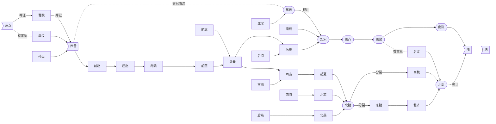

# 法制史学习笔记(个人向)_Part.3 
---

## 5. 三国两晋南北朝法律制度  
- 以下为三国魏晋南北朝直到唐代的历史发展脉络图：

- 自公元316年（`316.CE`）西晋灭亡到公元589年（`589.CE`）隋朝灭南陈统一中国，中国经历了**长达273年**（`整整一个明朝的国祚`）混乱的战国时期。在这段时期内，南北两方互相攻伐，生灵涂炭。同时，也是中华文明思想进步，文化繁荣，民族融合的时期，其法律制度的演变便是其中重要的命题。  
- 法硕考试重点关注**曹魏、西晋、南陈**和**整个北朝**的法律建设,又称为==九朝律考==。  

### 5.1 立法概况  

#### 5.1.1 曹魏律  
- 又称“==新律==”或者“==魏律==”，是三国时期最具代表性法律；  
- 曹魏律制定于==魏明帝曹叡==太和三年（`229.CE`）,此外蜀国制有《蜀科》（`三国中吴国就是废物`）。  
- **《曹魏律》在继承汉律的基础上进行了较大的改革**：    
    1. ==删繁就简==，增加篇目到18篇，扩充了法典的内容，又削弱了条文；  
    2. 将《法经》中的 《==具法》改名为《刑名》== 律，==放在律首==，突出了总则的性质和地位；  
    3. ==“八议”入律==，使得礼与律进一步融合；  
    4. ==改革刑罚==，使得刑罚制度进一步规范化；  

#### 5.1.2 泰始律<big><big>🌸</big></big>  
- 即**西晋律**，于泰始三年（`267.CE`）由==晋武帝司马炎==诏颁晋律，**共20篇**，被称为 ==《泰始律》==；  
- 《泰始律》的主要成就是<big><big>🌸</big></big>：  
    1. ==从“**刑名**”篇中分出“**法例**”篇==，完善了刑律总则的内容；  
    2. ==精简律令==，律文和字数均较汉律大为精简；  
    3. ==将律和令明确分开==，“**律以正罪名，令以存事制**”，解决了汉以来律令混杂、矛盾的局面（`律相当于一般法，令相当于特别法，令优先于律`）；  
    4. ==增强律注==，并于法典本文合为一体，律注与法条**具有同等的法律效力**；  
    5. ==第一次将礼中的“服制”列入律典==，作为定罪量刑的原则；  
    > 《晋律》颁行之后，经律学大家**张斐、杜预**作注，==释文和律文有同等法律效力==，史称 ==《张杜律》==。  

    > **《泰始律》为南朝沿用，影响深远**。  

#### 5.1.3 北魏律  
- 颁布于北魏==孝文帝拓跋宏==太和年间（`477.CE——493.CE`）,==共20篇==（`抄泰始律的`）；  
- 《北魏律》根据汉律、参酌魏晋律，经过“综合比较，取精用宏”而制定；  
- 《北魏律》**在刑名、罪名和刑罚原则诸方面皆有新的发展**。其修篆集当世律典之大成，==为隋唐律典之渊源==。  

#### 5.1.4 麟趾格  
- 是**东魏**政权制定的法典，因其议定于麟趾殿而得名。**“格”源于汉代的“科”**，北魏始以“格”代“科”，至东魏制定《麟趾格》，始为独立法典。  
- ==隋唐时候“格”成为重要的法律形式之一==。  

#### 5.1.5 大统式  
- “式”源于秦，秦简中有《**封诊式**》，汉代有《**品式章程**》。==西魏编定《**大统式**》==，成为历史上最早以“式”为形式的法典。  
- “式”也成为**重要的法律形式之一**。  

#### 5.1.6 北齐律<big><big>🌸</big></big>   
> 基本上全篇死背，必考。 
- 颁布于**武成帝高湛**河清三年（`564.CE`）完成，其特点为：      
    1. ==形成12篇的法典体例==（**北齐十二律**）；  
    2. ==首创《**名例律**》的法典篇目==（`名称一直沿用到清末`）；  
    3. ==确立“重罪十条”==，为后世之“**十恶**”所本；  
    4. ==确立了死、流、徒、杖、鞭这五刑==，为隋唐**新五刑体系**的最终建立奠定了基础；  
- 《北齐律》以“==法令明审，科条简要==”著称，在古代法典发展是上**起着承前启后的重要作用**，对隋唐立法尤具影响。  

#### 5.1.7 北周律  
- ==北周武帝宇文邕==保定三年（`563.CE`），制《==大律==》，**共25篇，1537条**。但是没有章法，古今杂糅，不合时宜。  
- 基本不考，是废物。

> 补充：  
> 程树德在《九朝律考》中指出：“自晋氏失驭，海内分裂，江左以清淡相尚，不崇名法。故其时中原律学，**衰于南而胜于北**。”  
> 总的来看，南北朝时北方律典兼容并蓄，日渐成熟。**它克服了南朝律的繁芜，避免了北周律的刻意复古**，==注重礼律并举==，又在罪名和形制上有所创新，因而为隋朝所取法。  

### 5.2 律学  
- 三国两晋南北朝时期是==中国传统律学发展的重要阶段==；  
- 魏晋时期，==律学开始从经学的束缚中解脱出来==，发展成为独立的学科。研究的对象也转变为侧重**立法技术、法律运用、刑名原理、定罪量刑原则以及法律术语的规范化解释**。==律学研究趋于规范化、科学化==；  
- 在这一时期，涌现了一批著名的律学家，如**陈群、张斐、杜预**（`提出九品中正制那位`）等；  
- 这一时期律学成就的代表：  
    1. ==张斐写的《律解》==、《汉晋律序注》；  
    2. ==杜预写的《律本》==；  
    3. 贾充、杜预合著的《==刑法律本==》；  
- 张斐晋律注曰：“**律始于刑名者，所以定罪制也**”。这体现了律学家对于《刑名》作为法典总则的性质、内容与地位，已经有了明确的认识和清晰的阐释。  
#### 5.2.1 二十律表<big><big>🌸</big></big>   
> 以下全背下来 
1. 故：知而犯之（`故意`）；  
2. ==失：意以为然==（`过于自信`）；  
3. 谩：违忠欺上（`欺骗皇帝`）；  
4. 诈：背信藏巧（`欺骗老百姓`）；  
5. 不敬：亏礼废节；  
6. ==斗：两讼相趣==（`打官司`）；  
7. ==戏：两和相害==（`两个和平的人互相杀害`）；  
8. 贼：无变斩击；  
9. ==过失：不意误犯==（`刑法学上的疏忽大意`）；  
10. 不道：逆节绝理（`逆天`）；  
11. 恶逆：陵上僭贵（`坟墓修的比皇帝还好`）；  
12. ==戕：将还未发==（`犯罪预备`）；  
13. ==造意：唱首先言==（`教唆`）；  
14. 谋：两人对议；  
15. ==率：制众建计==（`组织、策划`）；  
16. 强：不和（`使用暴力达成目的`）；  
17. ==略（掠）==：攻恶（`用暴力来掠夺`）；  
18. 群：三人（`三人及以上`）；  
19. 盗：取非其物；  
20. ==赃：货财之利==；  
> 凡二十者，律义之较名也。  

> 补充：罪刑法定原则的启蒙  
> 晋代==刘颂==提出：“**律法断罪，皆当以法律令正文**。若无正文，则附《名例》断之，其正文、《名例》**所不及，皆勿论**。” （`遇到案件先看法律，法律没有规定看总则，总则没有规定不定罪。`）  
> 这种==援法断罪==的思想，反映了罪刑法定的原则，是中国古代律学理论和法律思想的一大进步。这比西方的贝卡蒂亚要早了一千多年。  

### 5.3 刑事立法   
1. ==准五服以制罪==<big><big>🌸</big></big>  
    - 《泰始律》首立该制度，是指**亲属间的犯罪**，==根据==五等丧服所规定的==亲等来定罪量刑==。  
    - 该制度沿用一千多年，直至清末。  
    - “**五服**”本是中国古代**以丧服为标志**==确定亲属之间亲疏远近==的制度。  
    - 古代的五服为<big><big>🌸</big></big>：  
        1. **斩衰**：==父母==；  
        2. **齐`(si一声)`衰**：==叔伯、兄弟姐妹==；  
        3. **大功**：==堂兄弟==；  
        4. **小功**：舅、姨之类的；  
        5. **缌麻**：表兄弟姐妹； 
    - 汉代的五服结构 明清的五服结构：其中出现的成员属于当事人的九族。如果全被杀掉那就是**灭九族**。  
    -  